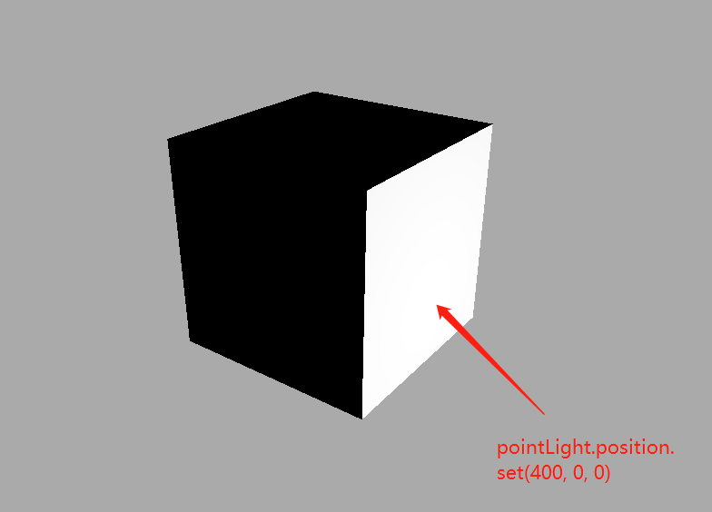

## Three——二、加强对三维空间的认识
接上个例子我们接着往下看
## 辅助观察坐标系
`THREE.AxesHelper()`的参数表示坐标系坐标轴线段尺寸大小，你可以根据需要改变尺寸。
使用方法：
```js
// AxesHelper：辅助观察的坐标系
const axesHelper = new THREE.AxesHelper(150);
scene.add(axesHelper);
```
效果如下：


## 材质半透明设置
设置材质半透明,这样可以看到坐标系的坐标原点。
```js
    const material = new THREE.MeshBasicMaterial({
      color: 0x51efe4,
      transparent: true, //开启透明
      opacity: 0.5, //设置透明度
    });
```


## 坐标轴
three.js坐标轴颜色红R、绿G、蓝B分别对应坐标系的x、y、z轴，对于three.js的3D坐标系默认y轴朝上。


## 设置模型在坐标系中的位置和尺寸
```js
// 设置几何体长宽高，也就是x、y、z三个方向的尺寸
//对比三个参数分别对应xyz轴哪个方向
// 长100，宽60，高20
new THREE.BoxGeometry(100, 60, 20);
// 以中心为原点向x轴坐标偏移100
mesh.position.set(100,0,0);
```


## 改变相机参数——预览新的渲染效果
你可以尝试源码中改变相机的参数，看看场景中的物体渲染效果怎么变化。

相机放在x轴负半轴，目标观察点是坐标原点，这样相当于相机的视线是沿着x轴正方向，只能看到长方体的一个矩形平面。
```js
camera.position.set(-1000, 0, 0);
camera.lookAt(0, 0, 0);
```

```js
// 相机视线沿着x轴负半轴，mesh位于相机后面，自然看不到
camera.position.set(-1000, 0, 0);
camera.lookAt(-2000, 0, 0);
```
相机far偏小，mesh位于far之外，物体不会显示在画布上。
```js
// const camera = new THREE.PerspectiveCamera(30, width / height, 1, 3000);
// 你可以进行下面测试，改变相机参数，把mesh放在视锥体之外，看看是否显示
// 3000改为300，使mesh位于far之外，mesh不在视锥体内，被剪裁掉
const camera = new THREE.PerspectiveCamera(30, width / height, 1, 300);
```
这里模型并不会出现在画布中


# 光源对物体表面影响
实际生活中物体表面的明暗效果是会受到光照的影响，threejs中同样也要模拟光照Light对网格模型Mesh表面的影响。


## 受光照影响材质
threejs提供的网格材质，有的受光照影响，有的不受光照影响。

基础网格材质`MeshBasicMaterial`不会受到光照影响。这个就是之前模型展示的材质

```js
//MeshBasicMaterial不受光照影响
const material = new THREE.MeshBasicMaterial(); 
```

漫反射网格材质`MeshLambertMaterial`会受到光照影响，该材质也可以称为Lambert网格材质，音译为兰伯特网格材质。这种材质就是可以`通过灯光去显示物体明暗的样子`。
一个立方体长方体使用MeshLambertMaterial材质，不同面和光线夹角不同，立方体不同面就会呈现出来不同的明暗效果。
```js
//MeshLambertMaterial受光照影响
const material = new THREE.MeshLambertMaterial(); 
```


## 光源简介
Three.js中给出了多种模拟生活中光源的API，在文档中查找light就可以看到


这三种光源看图片大家应该就可以理解，这里主要解释一下环境光后面还会说到
`环境光`主要就是把周围的场景的光打在模型上，比如阴，晴，日，夜，黄昏，黎明等，烘托主体，突出主体，在不使主体淹没在背景中，还具备营造环境气氛的作用

`点光源PointLight`可以类比为一个发光点，就像生活中一个灯泡以灯泡为中心向四周发射光线。

这里代码需要用到点光源，坐标，将光源加载场景中三部即可渲染在浏览器中查看效果
<strong>注意：这里的材质需要使用`MeshLambertMaterial`才能受到光照的影响</strong>
```js
//点光源：两个参数分别表示光源颜色和光照强度
// 参数1：0xffffff是纯白光,表示光源颜色
// 参数2：1.0,表示光照强度，可以根据需要调整
    const pointLight = new THREE.PointLight(0xffffff, 1.0);
    // pointLight.position.set(400, 0, 0);//点光源放在x轴上
    pointLight.position.set(100, 60, 50); //设置光源的位置
    // 光源和网格模型Mesh对应一样是三维场景的一部分，自然需要添加到三维场景中才能起作用。
    scene.add(pointLight); // 添加光源到场景中
```
下面是演示效果：



## 相机控件OrbitControls
平时开发调试代码，或者展示模型的时候，可以通过相机控件OrbitControls实现旋转缩放预览效果。

###  引入扩展库OrbitControls.js
```js
// 引入轨道控制器扩展库OrbitControls.js
import { OrbitControls } from 'three/addons/controls/OrbitControls.js';
```

注意：如果你在原生.html文件中，使用上面引入方式`import { OrbitControls } from 'three/addons/controls/OrbitControls.js'`;，注意通过`<script type="importmap">`配置。
```html
<script type="importmap">
  {
	"imports": {
	"three": "../../../three.js/build/three.module.js",
                 "three/addons/": "../../../three.js/examples/jsm/"
        }
  }
</script>

```

使用方式：
```js
  // 相机控件
  const control = ()=>{
    // 可以对物体进行操作
    controls = new OrbitControls(camera, renderer.domElement);
    controls.addEventListener('change', function () {
    // 每次拖动都会监听相机位置变化
    console.log('camera.position',camera.position);
});
  }
  control()
```


## 平行光与环境光
平行光`DirectionalLight`和环境光`AmbientLight`进一步了解光照对应模型Mesh表面的影响
### 点光源辅助观察PointLightHelper
预览观察：可以借助相机控件OrbitControls旋转缩放三维场景便于预览点光源位置
借上面的点光源例子添加辅助观察
```js
// 光源辅助观察
const pointLightHelper = new THREE.PointLightHelper(pointLight, 10);
scene.add(pointLightHelper);

```
效果如下：


### 环境光设置
环境光`AmbientLight`没有特定方向，只是整体改变场景的光照明暗。环境光就不需要加位置了，只有整体
```js
//环境光:没有特定方向，整体改变场景的光照明暗
  // 光源
  // 光源
  const linght = () => {
    const ambient = new THREE.AmbientLight(0xffffff, 1.0);
    scene.add(ambient);
  };
  linght();
```

### 平行光
平行光`DirectionalLight`就是沿着特定方向发射。
```js
// 平行光
const directionalLight = new THREE.DirectionalLight(0xffffff, 1);
// 设置光源的方向：通过光源position属性和目标指向对象的position属性计算
directionalLight.position.set(100, 50, 50);
// 方向光指向对象网格模型mesh，可以不设置，默认的位置是0,0,0
directionalLight.target = mesh;
scene.add(directionalLight);
```

### 平行光辅助观察`DirectionalLightHelper`
通过点光源辅助观察对象`DirectionalLightHelper`可视化点光源。
```js
const dirLightHelper = new THREE.DirectionalLightHelper(directionalLight, 5,0xff0000);
scene.add(dirLightHelper);
```

  