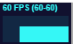

## 动画渲染循环

threejs 可以借助 HTML5 的 API 请求动画帧 window.requestAnimationFrame 实现动画渲染。

#### 请求动画帧`window.requestAnimationFrame`(实现周期性循环执行)

```js
// requestAnimationFrame实现周期性循环执行
// requestAnimationFrame默认每秒钟执行60次，但不一定能做到，要看代码的性能
let i = 0;
function render() {
  i += 1;
  console.log("执行次数" + i);
  requestAnimationFrame(render); //请求再次执行函数render
}
render();
```

#### 旋转动画

原理及一张张照片连起来依次显示，只要帧率变高，人眼就看不出来卡顿从而达到视频效果。

```js
// 必要的渲染器
const renderer = new THREE.WebGLRenderer();
renderer.setSize(width, height);
document.body.appendChild(renderer.domElement);

// 渲染函数
const render = () => {
  renderer.render(scene, camera); //执行渲染操作
  mesh.rotateY(0.01); //每次绕y轴旋转0.01弧度
  requestAnimationFrame(render); //请求再次执行渲染函数render，渲染下一帧
};
render();
```

实际效果：

#### 计算两帧渲染时间间隔和帧率

```js
// 计算两帧渲染时间间隔和帧率
const clock = new THREE.Clock();

// 动画渲染循环
const render = () => {
  const spt = clock.getDelta() * 1000;
  console.log("两帧渲染时间间隔(毫秒)", spt);
  console.log("帧率FPS", 1000 / spt);

  renderer.render(scene, camera); //执行渲染操作
  mesh.rotateY(0.01); //每次绕y轴旋转0.01弧度
  requestAnimationFrame(render); //请求再次执行渲染函数render，渲染下一帧
};
render();
```


## Canvas 画布布局和全屏

Threejs 渲染的结果是一个 canvas 画布，画布也是 HTML 元素之一，布局和普通前端的习惯是一样的
通过`renderer.domElement`属性可以访问 Threejs 的渲染结果，也就是 HTML 中的 canvas 画布。

#### 非全屏局部布局

只需要把 renderer.domElement 部分插入到 web 页上的任意一个元素都可以实现非全屏局部布局
例：

```html
<div class="container" ref="container"></div>
```

```js
let container = document.querySelector(".container");
let width = 500;
let height = 500;
const camera = new THREE.PerspectiveCamera(30, width / height, 1, 3000);

const renderer = new THREE.WebGLRenderer();
renderer.setSize(width, height); //设置three.js渲染区域的尺寸(像素px)
renderer.render(scene, camera); //执行渲染操作
//three.js执行渲染命令会输出一个canvas画布，也就是一个HTML元素，你可以插入到web页面中
// document.body.appendChild(renderer.domElement);
container.appendChild(renderer.domElement);
```

#### 全屏渲染

所谓的全屏渲染那就是把宽高改成当前窗口高度宽度即可

```js
const width = window.innerWidth; //窗口文档显示区的宽度作为画布宽度
const height = window.innerHeight; //窗口文档显示区的高度作为画布高度
const renderer = new THREE.WebGLRenderer();
document.body.appendChild(renderer.domElement);
```

#### 画布宽高动态变化

调整窗口大小时，canvas 布局会动态进行缩放

```js
window.addEventListener("resize", () => {
  // 更新摄像头
  camera.aspect = window.innerWidth / window.innerHeight;
  // 如果相机的一些属性发生了变化，需要执行updateProjectionMatrix ()方法更新相机的投影矩阵
  camera.updateProjectionMatrix();
  renderer.setSize(window.innerWidth, window.innerHeight);
});
```

## stats 查看 threejs 的渲染帧率

通过 stats.js 库可以查看 three.js 当前的渲染性能，具体说就是计算 three.js 的渲染帧率(FPS),所谓渲染帧率(FPS)，简单说就是 three.js 每秒钟完成的渲染次数，一般渲染达到每秒钟 60 次为最佳状态。

#### 引入 Stats

```js
// 性能监视器stats.js
import Stats from "three/addons/libs/stats.module.js";
```

#### Stats 使用

```js
//创建stats对象
const stats = new Stats();
//stats.domElement:web页面上输出计算结果,一个div元素，
document.body.appendChild(stats.domElement);
// 渲染函数
function render() {
  //requestAnimationFrame循环调用的函数中调用方法update(),来刷新时间
  stats.update();
  stats.setMode(1);
  renderer.render(scene, camera); //执行渲染操作
  requestAnimationFrame(render); //请求再次执行渲染函数render，渲染下一帧
}
render();
```

效果：


#### stats 方法 setMode(mode)

可以通过`setMode()`方法的参数 mode 的数值设置首次打开页面，测试结果的显示模式，鼠标单击可以更换不同的显示模式。

```js
// stats.domElement显示：渲染帧率  刷新频率,一秒渲染次数
stats.setMode(0); //默认模式
//stats.domElement显示：渲染周期 渲染一帧多长时间(单位：毫秒ms)
stats.setMode(1);
```

#### 性能测试

添加多个长方形对性能进行测试

```js
// 随机创建大量的模型,测试渲染性能
const num = 1000; //控制长方体模型数量
for (let i = 0; i < num; i++) {
  const geometry = new THREE.BoxGeometry(5, 5, 5);
  const material = new THREE.MeshLambertMaterial({
    color: 0x00ffff,
  });
  const mesh = new THREE.Mesh(geometry, material);
  // 随机生成长方体xyz坐标
  const x = (Math.random() - 0.5) * 200;
  const y = (Math.random() - 0.5) * 200;
  const z = (Math.random() - 0.5) * 200;
  mesh.position.set(x, y, z);
  scene.add(mesh); // 模型对象插入场景中
}
```

效果对比：


## 阵列立方体和相机适配体验

咱们接下来换个材质 `MeshBasicMaterial`
通过 for 循环在 x 轴循环一列模型

```js
const geometry = new THREE.BoxGeometry(100, 100, 100);
// 材质
const material = new THREE.MeshBasicMaterial({
  color: 0x00ffff,
  transparent: true, //开启透明
  opacity: 0.5, //设置透明度
});

// 网络模型
for (let i = 0; i < 10; i++) {
  mesh = new THREE.Mesh(geometry, material);
  mesh.position.set(i * 200, 20, 0);
  scene.add(mesh);
}
```

这里需要注意一下：图形循环增加，需要将透视的数值改的小一些

```js
// 透视投影相机PerspectiveCamera
// 支持的参数：fov, aspect, near, far
camera = new THREE.PerspectiveCamera(
  60,
  clientWidth / clientHeight,
  0.001, // 这里数值调小一些
  6000
);
```

效果如下：


## 双层 for 循环创建阵列模型

```js
// 几何体
const geometry = new THREE.BoxGeometry(100, 100, 100);
// 材质
const material = new THREE.MeshBasicMaterial({
  color: 0x00ffff,
  transparent: true, //开启透明
  opacity: 0.5, //设置透明度
});

// 网络模型
for (let i = 0; i < 10; i++) {
  for (let j = 0; j < 10; j++) {
    mesh = new THREE.Mesh(geometry, material);
    mesh.position.set(i * 200, 20, j * 200);
    scene.add(mesh);
  }
}
```


#### 相机位置拉远，可以看到更大的观察范围

```js
const camera = new THREE.PerspectiveCamera(30, width / height, 1, 3000);
// camera.position.set(292, 223, 185);
//在原来相机位置基础上拉远，可以观察到更大的范围
camera.position.set(800, 800, 800);
camera.lookAt(0, 0, 0);
```

#### 超出视锥体远裁界面的范围的会被剪裁掉

```js
// const camera = new THREE.PerspectiveCamera(30, width / height, 1, 3000);
const camera = new THREE.PerspectiveCamera(30, width / height, 1, 8000);
// camera.position.set(292, 223, 185);
// 超出视锥体远裁界面的范围的会被剪裁掉，不渲染  可以调整far参数适配
camera.position.set(2000, 2000, 2000);
camera.lookAt(0, 0, 0);
```


#### 改变相机观察目标

```js
// const camera = new THREE.PerspectiveCamera(30, width / height, 1, 3000);
const camera = new THREE.PerspectiveCamera(30, width / height, 1, 8000);
camera.position.set(2000, 2000, 2000);
// camera.lookAt(0, 0, 0);
// 改变相机观察目标点
camera.lookAt(1000, 0, 1000);
```

注意相机控件 OrbitControls 会影响 lookAt 设置，注意手动设置 OrbitControls 的目标参数

```js
// 设置相机控件轨道控制器OrbitControls
const controls = new OrbitControls(camera, renderer.domElement);
// 相机控件.target属性在OrbitControls.js内部表示相机目标观察点，默认0,0,0
// console.log('controls.target', controls.target);
controls.target.set(1000, 0, 1000);
controls.update(); //update()函数内会执行camera.lookAt(controls.targe)
```

改变前：

改变后：


<strong>透视投影相机的投影规律是远小近大，通过相机观察阵列立方体大小变化，可以看到距离相机越远，立方体的渲染视觉效果越小。</strong>

#### 关于 for 的改变

增加相机视角 fov，视锥体范围更大，意味着可以看到渲染范围更大，远小近大的视觉效果更明显。
