## Threejs 常见几何体简介

Three.js 常见的几何体：
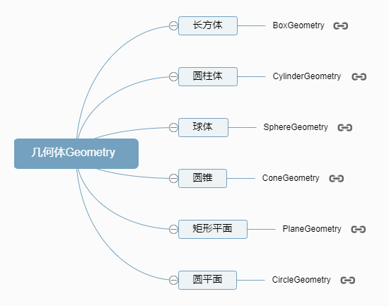
常见的几何体：

```js
//BoxGeometry：长方体
const geometry = new THREE.BoxGeometry(100, 100, 100);
// SphereGeometry：球体
const geometry = new THREE.SphereGeometry(50);
// CylinderGeometry：圆柱
const geometry = new THREE.CylinderGeometry(50, 50, 100);
// PlaneGeometry：矩形平面
const geometry = new THREE.PlaneGeometry(100, 50);
// CircleGeometry：圆形平面
const geometry = new THREE.CircleGeometry(50);
```

这里拿平面做示例：
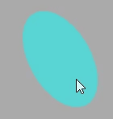

#### 双面可见

Three.js 的材质默认正面可见，反面不可见,对于矩形平面`PlaneGeometry`、圆形平面如果你想看到两面，可以设置`side: THREE.DoubleSide`。

```js
new THREE.MeshBasicMaterial({
  side: THREE.FrontSide, //默认只有正面可见
});
```

```js
new THREE.MeshBasicMaterial({
  side: THREE.DoubleSide, //两面可见
});
```

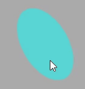

## 高光网络材质

高光网格材质`MeshPhongMaterial`和基础网格材质`MeshBasicMaterial`、漫反射网格材质`MeshLambertMaterial`一样都是网格模型的 Mesh 的材质。

注意：<strong>高光网格材质`MeshPhongMaterial`和漫反射网格材质`MeshLambertMaterial`一样会受到光照的影响。</strong>

#### MeshPhongMaterial 对光照反射特点

`MeshPhongMaterial`和`MeshLambertMaterial`都会收到光照的影响区别在于，对光线反射方式有差异。

`MeshPhongMaterial`可以实现高光反射效果，而`MeshLamberMaterial`恰恰相反。所谓的高光，就比如你在一个太阳下方去看一个小汽车，你会在特定的角度及位置看到玻璃表面某个位置特别亮。

#### 镜面反射与漫反射

`MeshPhongMaterial`可以提供一个镜面的反射效果，可以类比你生活中拿一面镜子，放在太阳光下，调整角度，可以把太阳光反射到其它地方，如果反射光对着眼睛，也就是反射光线和视线平行的时候，会非常刺眼。

`MeshLambertMaterial`对应的 Mesh 受到光线照射，没有镜面反射的效果，只是一个漫反射，也就是光线向四周反射。
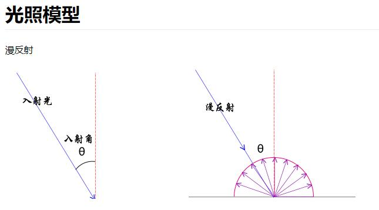

#### 高光亮度属性`shininess`

通过`MeshPhongMaterial`的高光亮度`shininess`属性，可以控制高光反射效果

```js
// 模拟镜面反射，产生一个高光效果
const material = new THREE.MeshPhongMaterial({
  color: 0x00ffff,
  shininess: 500, //高光部分的亮度，默认30
});
```

数字越大，光越亮
对比效果:


下面是使用`MeshLambertMaterial`材质的效果：
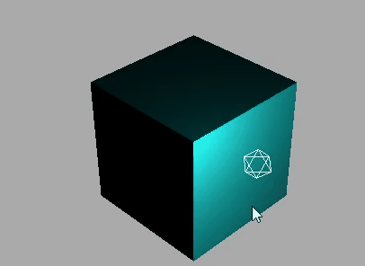

#### WebGL 渲染器设置(锯齿模糊)

设置渲染器锯齿属性：antialias

```js
const renderer = new THREE.WebGLRenderer({
  antialias: true,
});
```

对比：
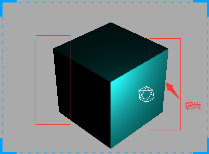
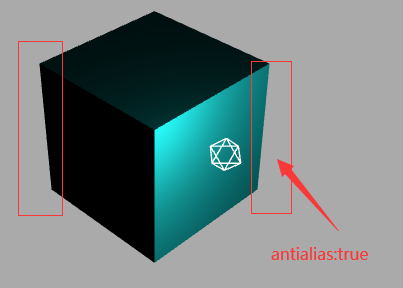

#### 设置背景的两种方式

```js
scene.background = new THREE.Color(0xaaaaaa);
// or
// renderer.setClearColor(0xffffff, 1); //设置背景颜色
```

## gui.js 库

#### 简介

借助 gui.js 可以快速创建控制三维场景的 UI 交互界面

gihtub 地址：https://github.com/dataarts/dat.gui
npm 地址：https://www.npmjs.com/package/dat.gui

<strong>three 中自带了 gui 库</strong>

```js
import { GUI } from "three/addons/libs/lil-gui.module.min.js";
```

#### 创建 GUI 对象

```js
const gui = new GUI();
```

#### 通过`domElement`改变 GUI 界面默认的 style 属性

尝试改变他的位置和长度

```js
const gui = new GUI();
gui.domElement.style.right = "0px";
gui.domElement.style.width = "300px";
```

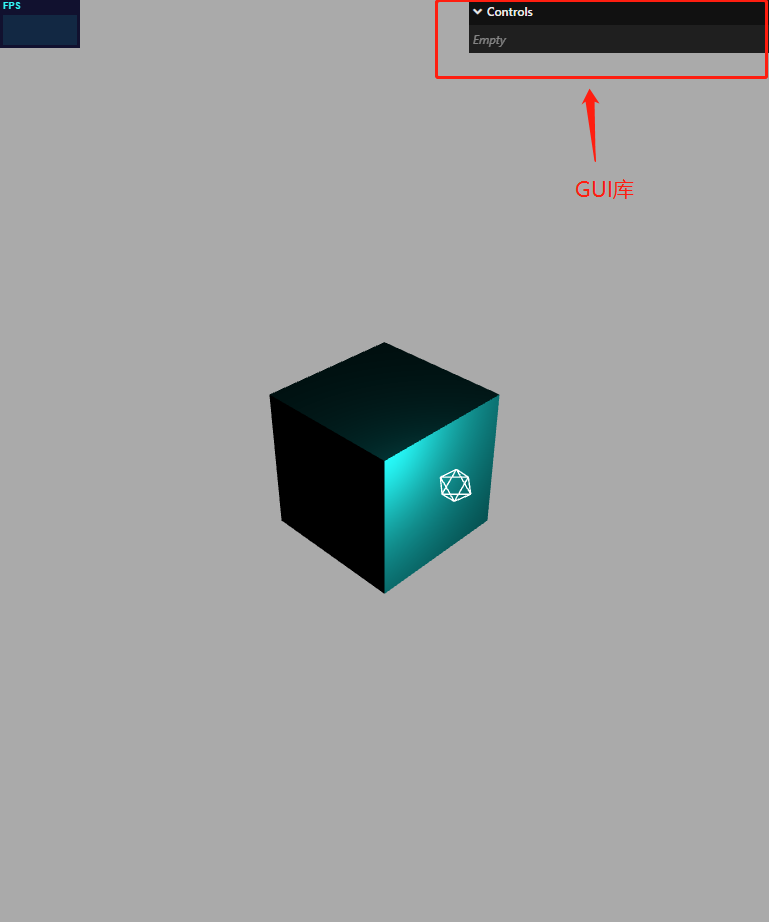
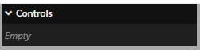

#### add()方法

`add()`方法可以创建一个交互界面，例如滚动条，从而改变 js 对象属性的属性值

```js
.add(控制对象，对象具体属性，其它参数)
```

其他参数，可以一个或多个，数据类型也可以不同，gui 会自动根据参数形式，自动生成对应的交互界面。

参数 3 和参数 4，分别是一个数字，交互界面是一个鼠标可以拖动的拖动条，可以在一个区间改变属性的值

```js
const obj = {
  x: 30,
};
gui.add(obj, "x", 0, 100);
```

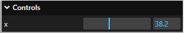

#### gui 改变 js 对象多个属性

```js
const obj = {
  x: 30,
  y: 60,
  z: 300,
};
// gui界面上增加交互界面，改变obj对应属性
gui.add(obj, "x", 0, 100);
gui.add(obj, "y", 0, 50);
gui.add(obj, "z", 0, 60);
```

#### 通过 gui 改变 threejs 光照强度测试

给光源绑定`intensity`属性，通过 gui 的拖动条来改变光源属性

```js
// 需要光源和光源位置信息
// const pointLight = new THREE.PointLight(0xffffff, 1.0);
// pointLight.position.set(100, 60, 50);

gui.add(pointLight, "intensity", 0, 2.0);
scene.add(pointLight);

// 光源辅助观察
// const pointLightHelper = new THREE.PointLightHelper(pointLight, 10);
// scene.add(pointLightHelper);
```

效果：会将下方绑定模型位置同时进行演示

#### gui 绑定模型位置

`mesh.position`是 JavaScript 对象，具有 x、y、z 属性,这三个属性分别表示模型的 xyz 坐标，这就是说，gui 改变`mesh.position`的 x、y、z 属性，就可以可视化改变 mesh 的位置。

```js
function guiFun() {
  gui.add(mesh.position, "x", 0, 100);
  gui.add(mesh.position, "y", 0, 50);
  gui.add(mesh.position, "z", 0, 60);
}
```

效果演示：
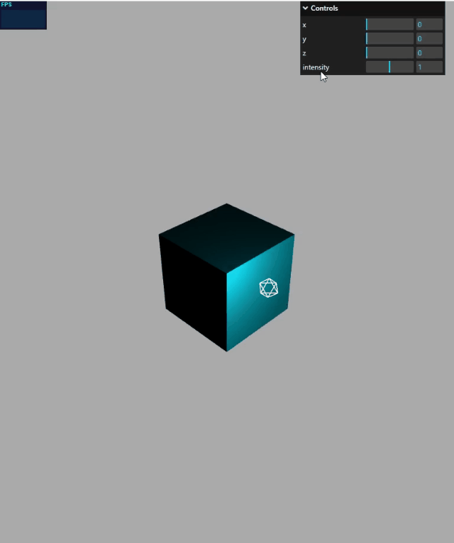

#### name()

name 属性可以将默认值改成所需文字

```js
gui.add(pointLight, "intensity", 0, 2.0).name("光源");
```

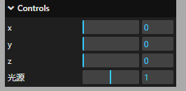

#### step()步长

每次拖动的间隔

```js
gui.add(pointLight, "intensity", 0, 2.0).name("光源").step(0.1);
```

#### onChange()方法

当 gui 界面某个值的时候，.onChange()方法就会执行，这时候你可以根据需要通过.onChange()执行某些代码。就是可以将老值被新值替换。

```js
let obj = {
  x: 30,
  y: 30,
  z: 30,
};
gui.add(obj, "x", 0, 180).onChange(function (value) {
  mesh.position.x = value;
});
```

#### gui 改变材质颜色

```js
const obj = {
  color: 0x00ffff,
};
// .addColor()生成颜色值改变的交互界面
gui.addColor(obj, "color").onChange(function (value) {
  mesh.material.color.set(value);
});
```

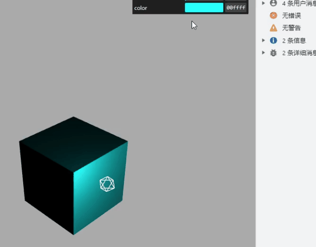

## gui 下拉菜单

通过.add()方法创建新的 UI 交互界面，下拉框、单选框

#### 1、 .add()方法参数 3 和 4 数据类型：数字

此方法如上

```js
add(控制对象，对象具体属性，其他参数)
```

其他参数，可以一个或多个，数据类型也可以不同，gui 会自动根据参数形式，自动生成对应的交互界面。

#### 2、.add()方法参数 3 数据类型：数组

参数 3 如果是一个数组的话，那么他的交互界面是下拉菜单
例如：

```js
const obj = {
  scale: 0,
};
gui
  .add(obj, "scale", [-100, 0, 100])
  .name("x轴坐标")
  .onChange(function (value) {
    mesh.position.x = value;
  });
```

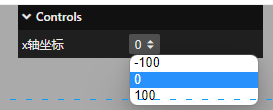

#### 3、 .add()方法参数 3 数据类型：对象

参数 3 如果为对象，那么生成的交互界面也会是下拉菜单
例如：

```js
const obj = {
  scale: 0,
};
// 参数3数据类型：对象(下拉菜单)
gui
  .add(obj, "scale", {
    left: -100,
    center: 0,
    right: 100,
    // 左: -100,//可以用中文
    // 中: 0,
    // 右: 100
  })
  .name("位置选择")
  .onChange(function (value) {
    mesh.position.x = value;
  });
```

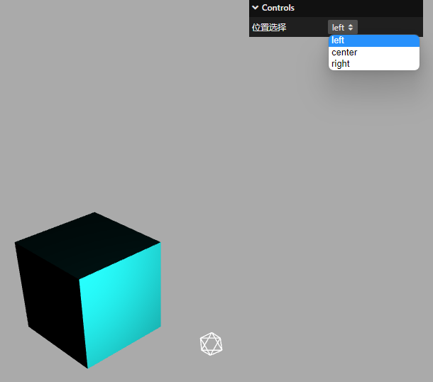

#### 4、.add()方法对应属性的数据类型：布尔值

如果`.add()`改变属性的数据类型如果是布尔值，那么交互界面就是一个单选按钮
例如：

```js
const obj = {
  bool: false,
};
// 改变的obj属性数据类型是布尔值，交互界面是单选框
gui.add(obj, "bool").name("是否旋转");
```

```js
gui.add(obj, "bool").onChange(function (value) {
  // 点击单选框，控制台打印obj.bool变化
  console.log("obj.bool", value);
});
```

案例：控制旋转模型

```js
const obj = {
  bool: false,
};
gui.add(obj, "bool").name("旋转动画");
const render = () => {
  if (obj.bool) mesh.rotateY(0.01);
  renderer.render(scene, camera);
  requestAnimationFrame(render);
};
render();
```

效果：
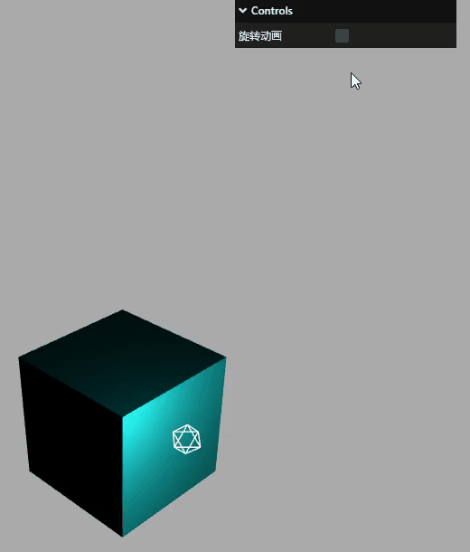

## gui.js 库(分组)

如果页面出现控制的属性较多时，为了避免混合，可以适当进行分组管理
例如：

```js
const gui = new GUI(); //创建GUI对象
//创建一个对象，对象属性的值可以被GUI库创建的交互界面改变
const obj = {
  color: 0x00ffff, // 材质颜色
  specular: 0x111111, // 材质高光颜色
};

// 材质颜色color
gui.addColor(obj, "color").onChange(function (value) {
  material.color.set(value);
});
// 材质高光颜色specular
gui.addColor(obj, "specular").onChange(function (value) {
  material.specular.set(value);
});

// 环境光强度
gui.add(ambient, "intensity", 0, 2);
// 平行光强度
gui.add(directionalLight, "intensity", 0, 2);
// 平行光位置
gui.add(directionalLight.position, "x", -400, 400);
gui.add(directionalLight.position, "y", -400, 400);
gui.add(directionalLight.position, "z", -400, 400);
```

#### 使用.addFolder()分组

环境光子菜单部分

```js
const gui = new GUI();
let obj = {
  color: 0x00ffff, // 材质颜色
  specular: 0xff0000,
};
const matFolder = gui.addFolder("材质");

// 材质子菜单部分
matFolder.close();
matFolder.addColor(obj, "color").onChange(function (value) {
  material.color.set(value);
  console.log(material.specular.set(value));
});
matFolder.addColor(obj, "specular").onChange(function (value) {
  material.specular.set(value);
});
```

环境光子菜单部分

```js
const ambientFolder = gui.addFolder("环境光");
ambientFolder.add(pointLight, "intensity", 0, 2);
```

平行光

```js
const dirFolder = gui.addFolder("平行光强度");

// 光源辅助观察
// const pointLightHelper = new THREE.PointLightHelper(pointLight, 10);
// scene.add(pointLightHelper);
// const directionalLight = new THREE.DirectionalLight(0xffffff, 1.0);
// directionalLight.position.set(100, 0, 0);

// // 方向光指向对象网格模型mesh，可以不设置，默认的位置是0,0,0
// directionalLight.target = mesh;
// // 辅助观察
// const dirLightHelper = new THREE.DirectionalLightHelper(
//   directionalLight,
//   5,
//   0xff0000
// );
// // 添加辅助标识
// scene.add(dirLightHelper);
// // 添加平行光到场景中
// scene.add(directionalLight);
// 平行光强度
dirFolder.add(directionalLight, "intensity", 0, 2);
// 平行光位置
dirFolder.add(directionalLight.position, "x", -400, 400);
dirFolder.add(directionalLight.position, "y", -400, 400);
dirFolder.add(directionalLight.position, "z", -400, 400);
```

显示效果如下：


#### 关闭.close()和展开.open()交互界面

用`.close()`和`.open()`方法可以设置默认是否折叠还是展开，默认状态为<strong>open()</strong>

```js
// 菜单名称.close();
dirFolder.close();
matFolder.close();
```

效果如下：
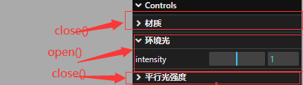

#### .addFolder()子菜单嵌套

通过 addFolder 可以再次进行 addFolder 完成子菜单嵌套

```js
const dirFolder2 = dirFolder.addFolder("位置"); //子菜单的子菜单
```

```js
dirFolder.add(directionalLight, "intensity", 0, 2);
const dirFolder2 = dirFolder.addFolder("位置"); //子菜单的子菜单
dirFolder2.close(); //关闭菜单
// 平行光位置
dirFolder2.add(directionalLight.position, "x", -400, 400);
dirFolder2.add(directionalLight.position, "y", -400, 400);
dirFolder2.add(directionalLight.position, "z", -400, 400);

// 平行光位置
dirFolder.add(directionalLight.position, "x", -400, 400);
dirFolder.add(directionalLight.position, "y", -400, 400);
dirFolder.add(directionalLight.position, "z", -400, 400);
dirFolder.close();
```

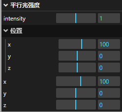

至此可以基本的掌握了 three.js 中基本的用法，本专栏只用来学习交流，最后附上示例代码，详情可参考郭老师的电子书:http://www.webgl3d.cn/

```html
<!-- author: Mr.J -->
<!-- date: 2023-04-12 11:43:45 -->
<!-- description: Vue3+JS代码块模板 -->
<template>
  <div class="container" ref="container"></div>
</template>

<script setup>
  import * as THREE from "three";
  // 轨道
  import { OrbitControls } from "three/examples/jsm/controls/OrbitControls";
  import { ref, reactive, onMounted } from "vue";
  import { GUI } from "three/addons/libs/lil-gui.module.min.js";
  // 三个必备的参数
  let scene, camera, renderer, controls, mesh, stats, material;
  import Stats from "three/addons/libs/stats.module.js";
  // gui
  const gui = new GUI();
  // 旋转控制
  let obj = {
    color: 0x00ffff, // 材质颜色
    specular: 0xff0000,
  };
  const matFolder = gui.addFolder("材质");
  const ambientFolder = gui.addFolder("环境光");
  const dirFolder = gui.addFolder("平行光强度");
  onMounted(() => {
    // 外层需要获取到dom元素以及浏览器宽高，来对画布设置长宽
    // clientWidth等同于container.value.clientWidth
    let container = document.querySelector(".container");
    const { clientWidth, clientHeight } = container;
    console.log(clientHeight);
    init();
    render();

    // 首先需要获取场景，这里公共方法放在init函数中
    function init() {
      scene = new THREE.Scene();
      // 给相机设置一个背景
      scene.background = new THREE.Color(0xaaaaaa);
      // 透视投影相机PerspectiveCamera
      // 支持的参数：fov, aspect, near, far
      camera = new THREE.PerspectiveCamera(
        60,
        clientWidth / clientHeight,
        0.001,
        6000
      );
      // 相机坐标
      camera.position.set(300, 300, 300);
      // 相机观察目标
      camera.lookAt(scene.position);
      // 渲染器
      renderer = new THREE.WebGLRenderer({
        antialias: true,
      });
      // 渲染多大的地方
      renderer.setSize(clientWidth, clientHeight);

      container.appendChild(renderer.domElement);
      stats = new Stats();
      container.appendChild(stats.domElement);
      addBox();
      console.log("查看当前屏幕设备像素比", window.devicePixelRatio);
    }

    function addBox() {
      // 模型部分
      // 几何体
      const geometry = new THREE.BoxGeometry(100, 100, 100);
      // 材质
      material = new THREE.MeshPhongMaterial({
        color: 0x00ffff,
        transparent: true, //开启透明
        // opacity: 0.5, //设置透明度
        // side: THREE.DoubleSide, //两面可见
        shininess: 500,
        specular: 0xff0000, //高光部分的颜色
      });
      mesh = new THREE.Mesh(geometry, material);
      mesh.position.set(0, 0, 0);
      scene.add(mesh);
      guiFun();
    }

    function guiFun() {
      matFolder.close();
      matFolder.addColor(obj, "color").onChange(function (value) {
        material.color.set(value);
        console.log(material.specular.set(value));
      });
      matFolder.addColor(obj, "specular").onChange(function (value) {
        material.specular.set(value);
      });
      /*     const obj = {
      scale: 0,
    };
    // 参数3数据类型：对象(下拉菜单)
    gui.add(obj, "scale", {
        left: -100,
        center: 0,
        right: 100,
        // 左: -100,//可以用中文
        // 中: 0,
        // 右: 100
      })
      .name("位置选择")
      .onChange(function (value) {
        mesh.position.x = value;
      }); */
      /*     const obj = {
      bool: false,
    };
    // 改变的obj属性数据类型是布尔值，交互界面是单选框
    gui
      .add(obj, "bool")
      .name("是否旋转")
      .onChange(function (value) {
        // 点击单选框，控制台打印obj.bool变化
        console.log("obj.bool", value);
      }); */
    }

    // 相机控件
    const control = () => {
      controls = new OrbitControls(camera, renderer.domElement);
      controls.addEventListener("change", function () {
        // 浏览器控制台查看相机位置变化
        // console.log("camera.position", camera.position);
      });
    };
    control();

    // 光源
    const linght = () => {
      const pointLight = new THREE.PointLight(0xffffff, 1.0);
      pointLight.position.set(100, 60, 50);
      ambientFolder.add(pointLight, "intensity", 0, 2);
      scene.add(pointLight);

      // 光源辅助观察
      const pointLightHelper = new THREE.PointLightHelper(pointLight, 10);
      scene.add(pointLightHelper);
      const directionalLight = new THREE.DirectionalLight(0xffffff, 1.0);
      directionalLight.position.set(100, 0, 0);

      // 方向光指向对象网格模型mesh，可以不设置，默认的位置是0,0,0
      directionalLight.target = mesh;
      // 辅助观察
      const dirLightHelper = new THREE.DirectionalLightHelper(
        directionalLight,
        5,
        0xff0000
      );
      // 添加辅助标识
      scene.add(dirLightHelper);
      // 添加平行光到场景中
      scene.add(directionalLight);
      // 平行光强度
      dirFolder.add(directionalLight, "intensity", 0, 2);
      const dirFolder2 = dirFolder.addFolder("位置"); //子菜单的子菜单
      dirFolder2.close(); //关闭菜单
      // 平行光位置
      dirFolder2.add(directionalLight.position, "x", -400, 400);
      dirFolder2.add(directionalLight.position, "y", -400, 400);
      dirFolder2.add(directionalLight.position, "z", -400, 400);

      // 平行光位置
      dirFolder.add(directionalLight.position, "x", -400, 400);
      b;
      dirFolder.add(directionalLight.position, "y", -400, 400);
      dirFolder.add(directionalLight.position, "z", -400, 400);
      dirFolder.close();
    };
    linght();

    // gui.add(obj, "bool").name("旋转动画");
    function render() {
      // if (obj.bool) mesh.rotateY(0.01);
      renderer.render(scene, camera);
      requestAnimationFrame(render);
    }
    window.addEventListener("resize", () => {
      // 更新摄像头
      camera.aspect = window.innerWidth / window.innerHeight;
      camera.updateProjectionMatrix();
      renderer.setSize(window.innerWidth, window.innerHeight);
    });
    /*   const obj = {
    bool: false,
  };
  gui.add(obj, "bool").name("旋转动画");
  const render = () => {
    if (obj.bool) mesh.rotateY(0.01);
    renderer.render(scene, camera);
    requestAnimationFrame(render);
  };
  render(); */
  });
</script>

<style>
  .container {
    width: 100%;
    height: 100vh;
    position: relative;
    z-index: 1;
  }
</style>
```
