目录：本章节针对与几何体进行效果展示
Threejs——点线模型对象、三角形概念、几何体顶点位置，顶点索引、法线以及对几何体进行旋转缩放和平移
# 关于几何体BufferGeomety

## 几何体顶点位置数据和点模型
#### 缓冲类型几何体`BufferGeometry`
如果你想创作出不规则几何形状，那么就可以通过`BufferGeometry`来进行自定义，也就是所谓的顶点数据
例：创建一个空的几何体对象
```js
const geometry = new Three.BufferGeometry();
```
利用js中的类型化数组`Float32Array`创建xyz坐标数据来表示顶点坐标
```js
//类型化数组创建顶点数据
const vertices = new Float32Array([
    0, 0, 0, //顶点1坐标
    50, 0, 0, //顶点2坐标
    0, 100, 0, //顶点3坐标
    0, 0, 10, //顶点4坐标
    0, 0, 100, //顶点5坐标
    50, 0, 10, //顶点6坐标
]);
```
##### 缓冲区对象`BufferAttribute`表示几何体顶点数据
```javascript
// 创建属性缓冲区对象
//3个为一组，表示一个顶点的xyz坐标
const attribue = new THREE.BufferAttribute(vertices, 3); 
```

##### 设置几何体顶点位置`.attributes.position`
```js
geometry.attributes.position = attribue;
```
```js
    const geometry = new THREE.BufferGeometry();
    const vertices = new Float32Array([
      0, 0, 0, //顶点1坐标
      50, 0, 0, //顶点2坐标
      0, 100, 0, //顶点3坐标
      0, 0, 10, //顶点4坐标
      0, 0, 100, //顶点5坐标
      50, 0, 10, //顶点6坐标
    ])
    const attribue = new THREE.BufferAttribute(vertices, 3);
    geometry.attributes.position = attribue;
    // 材质
    material = new THREE.MeshBasicMaterial({
      color: 0x00ffff,
      transparent: true, //开启透明
      // opacity: 0.5, //设置透明度
      side: THREE.DoubleSide, //两面可见
      shininess: 500,
    });
    mesh = new THREE.Mesh(geometry, material);
    mesh.position.set(0, 0, 0);
    scene.add(mesh);
```
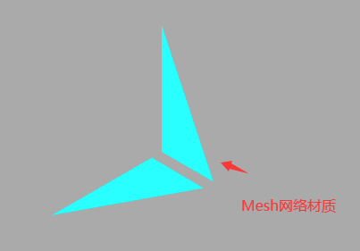

## 点模型`Points`
顾名思义就是将`Mesh`面材质换成点
例如:
```js
// 点渲染模式
const material = new THREE.PointsMaterial({
    color: 0x00ffff,
    size: 10.0 //点对象像素尺寸
}); 
```
将几何体转成点模型
```js
const points = new THREE.Points(geometry, material); //点模型对象
```
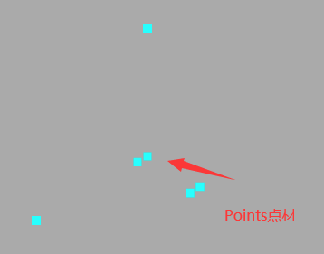

## `Line`线模型对象
线模型就是从第一个点开始连接，一直到最后一个点，依次连成线条
##### 线材质对象`LineBasicMaterial`
我们这里保留三个点形成一个三角形
```js
const vertices = new Float32Array([
    0, 0, 0, 
    50, 0, 0, 
    0, 100, 0, 
]);
```
```js
// 线材质对象
const material = new THREE.LineBasicMaterial({
    color: 0x00ffff //线条颜色
}); 
// 创建线模型对象
const line = new THREE.Line(geometry, material);
```
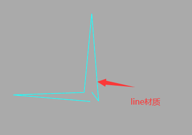
这里会发现最后一条线没有连接起来从而展现闭合的效果，接着往下看。

#### 线模型`LineLoop`
用来闭合线条
```js
// 闭合线条
const line = new THREE.LineLoop(geometry, material); 
```


#### 非连续线条`LineSegments`
```js
//非连续的线条
const line = new THREE.LineSegments(geometry, material);
```
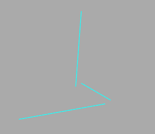


## 网络模型(三角形概念)
网络模型`Mesh`是通过一个或多个三角形的拼接而成。使用使用网格模型Mesh渲染几何体geometry，就是几何体所有顶点坐标三个为一组，构成一个三角形，多组顶点构成多个三角形，就可以用来模拟表示物体的表面。


#### 双面可见
前面已经所过如和让两面都可见
```js
const material = new THREE.MeshBasicMaterial({
    color: 0x00ffff , //材质颜色
    side: THREE.FrontSide, //默认只有正面可见
});
```
```js
const material = new THREE.MeshBasicMaterial({
    side: THREE.DoubleSide, //两面可见
});

```
```js
const material = new THREE.MeshBasicMaterial({
    side: THREE.BackSide, //设置只有背面可见
});

```

## 构建矩形平面几何体
关于坐标点该从哪里出发，这里正面通过逆时针去连线，反面通过顺时针连起来，逆时针(<strong>从下往上，从右往左</strong>)


所以生成一个平面正方形的坐标为
```js
    const geometry = new THREE.BufferGeometry();
    const vertices = new Float32Array([
      0, 0, 0, 
      80, 0, 0, 
      80, 80, 0, 
      
      0, 0, 0, 
      80, 80, 0, 
      0, 80, 0,
    ]);
    const attribue = new THREE.BufferAttribute(vertices, 3);

    geometry.attributes.position = attribue;
    // 材质
    material = new THREE.LineBasicMaterial({
      color: 0x00ffff,
    });
    // 换成闭合线条效果
    mesh = new THREE.LineLoop(geometry, material);
    mesh.position.set(0, 0, 0);
    scene.add(mesh);
```
咱们给场景中加一个坐标系看一下
```js
    const axesHelper = new THREE.AxesHelper(150);
    scene.add(axesHelper);
```
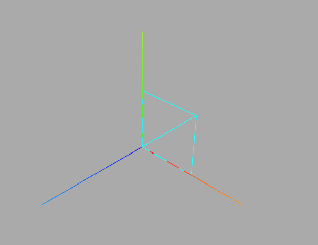


## 几何体顶点索引数据
减少三角形的顶点坐标数量，可以借助几何体顶点索引`geometry.index`来实现
```js
const vertices = new Float32Array([
    0, 0, 0, //顶点1坐标
    80, 0, 0, //顶点2坐标
    80, 80, 0, //顶点3坐标
    0, 0, 0, //顶点4坐标   和顶点1位置相同
    80, 80, 0, //顶点5坐标  和顶点3位置相同
    0, 80, 0, //顶点6坐标
]);

```
如果有重复的可以把重复的顶点删除
```js
const vertices = new Float32Array([
    0, 0, 0, //顶点1坐标
    80, 0, 0, //顶点2坐标
    80, 80, 0, //顶点3坐标
    0, 80, 0, //顶点4坐标
   ]);
```
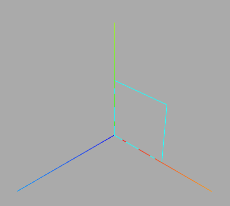

#### 通过`BufferAttribute`来创建顶点索引`.index`的数据
通过js中的类型化数组`Unit16Array`来创建顶点索引`.index`的数据
```js
const indexes = new Uint16Array([
    // 下面索引值对应顶点位置数据中的顶点坐标
    0, 1, 2, 0, 2, 3,
])
```
通过缓冲区对象`BufferAttribute`来表示几何体顶点索引`.index`数据
```js
geometry.index = new THREE.BufferAttribute(indexes, 1); // 1个为一组
```
效果如下：


## 顶点法线数据
一个新的顶点数据，顶点法线(法向量)数据`geometry.attributes.normal`
如果将`MeshBasicMaterial`材质改为`MeshLambertMaterial`材质,这里的矩形平面无法正常渲染，因为使用受光照印象的材质，几何体必须需要定义<strong>顶点法线</strong>数据。
代码：
```js
    const geometry = new THREE.BufferGeometry();
    const vertices = new Float32Array([0, 0, 0, 80, 0, 0, 80, 80, 0, 0, 80, 0]);

    const indexes = new Uint16Array([
      // 下面索引值对应顶点位置数据中的顶点坐标
      0, 1, 2, 0, 2, 3,
    ]);
    const attribue = new THREE.BufferAttribute(vertices, 3);
    geometry.index = new THREE.BufferAttribute(indexes, 1); //1个为一组
    geometry.attributes.position = attribue;
    // 材质
    material = new THREE.MeshBasicMaterial({
      color: 0x00ffff,
      transparent: true, //开启透明
      // opacity: 0.5, //设置透明度
      side: THREE.DoubleSide, //两面可见
    });
    mesh = new THREE.Mesh(geometry, material);
    mesh.position.set(0, 0, 0);
    scene.add(mesh);
```

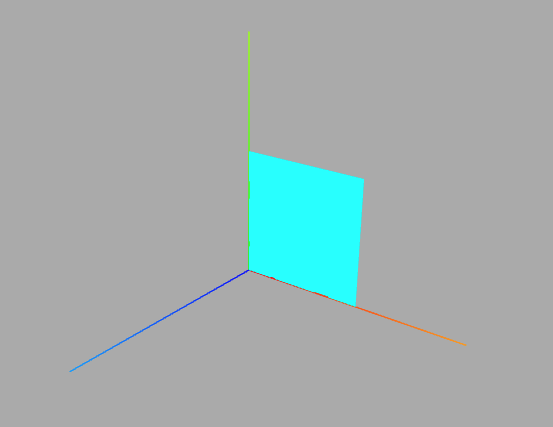
将材质换为`MeshLambertMaterial`后
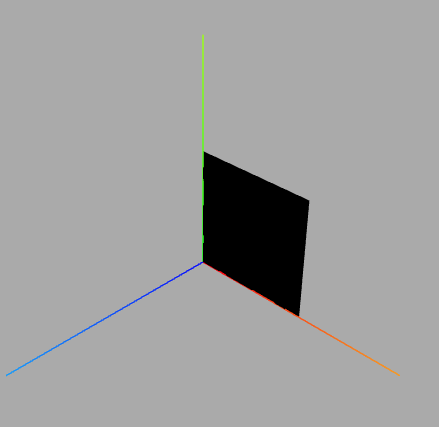
#### 矩形平面几何体法线————无顶点索引
Three.js中法线是通过顶点定义，默认情况下，每个顶点都有一个法线数据，就像每一个顶点都有一个位置数据。
```js
// 矩形平面，无索引，两个三角形，6个顶点
// 每个顶点的法线数据和顶点位置数据一一对应
const normals = new Float32Array([
    0, 0, 1, //顶点1法线( 法向量 )
    0, 0, 1, //顶点2法线
    0, 0, 1, //顶点3法线
    0, 0, 1, //顶点4法线
    0, 0, 1, //顶点5法线
    0, 0, 1, //顶点6法线
]);
// 设置几何体的顶点法线属性.attributes.normal
geometry.attributes.normal = new THREE.BufferAttribute(normals, 3); 
```
效果：
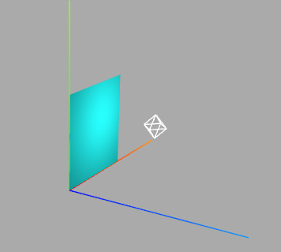

#### 有顶点索引
```js
// 矩形平面，有索引，两个三角形，有2个顶点重合，有4个顶点
// 每个顶点的法线数据和顶点位置数据一一对应
const normals = new Float32Array([
    0, 0, 1, //顶点1法线( 法向量 )
    0, 0, 1, //顶点2法线
    0, 0, 1, //顶点3法线
    0, 0, 1, //顶点4法线
]);
// 设置几何体的顶点法线属性.attributes.normal
geometry.attributes.normal = new THREE.BufferAttribute(normals, 3);
```


## 查看three.js自带几何体顶点
#### 查看几何体顶点位置和索引数据
如果我想直接知道矩形平面的定点位置和索引数据，那么可以用属性在控制台中打印查看

```js
// const geometry = new THREE.PlaneGeometry(100,50); //矩形平面几何体
const geometry = new THREE.BoxGeometry(100,100,100); //长方体

console.log('几何体',geometry);
console.log('顶点位置数据',geometry.attributes.position);
console.log('顶点索引数据',geometry.index);
```

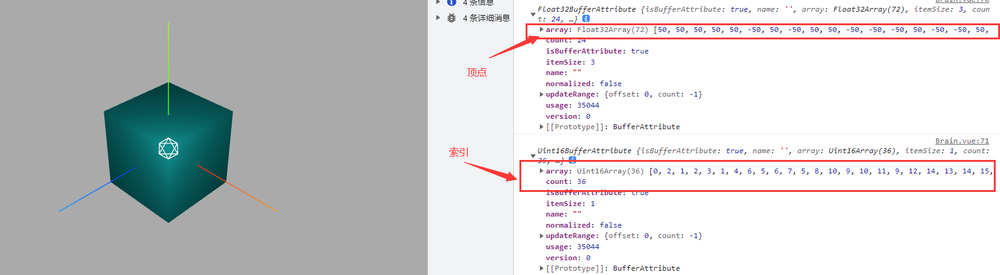


#### 材质属性`wireframe`

```js
const material = new THREE.MeshLambertMaterial({
    color: 0x00ffff, 
    wireframe:true,//线条模式渲染mesh对应的三角形数据
});
```
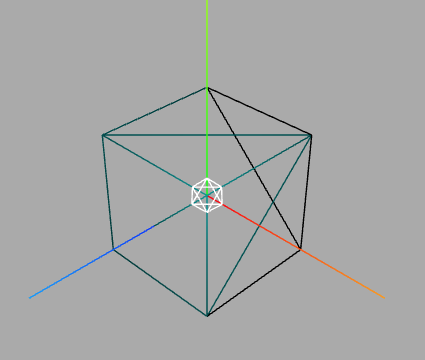

#### 几何体细分数
矩形平面几何体至少需要两个三角形拼接而成。矩形几何体`PlaneGeometry`中参数的3,4就是表示细分数，默认值是1,1
```js
 //矩形几何体PlaneGeometry的参数3,4表示细分数，默认是1,1
const geometry = new THREE.PlaneGeometry(100,50,1,1);
```
```js
// 一个矩形一分为二，每个矩形上有两个三角形，也就是四个
const geometry = new THREE.PlaneGeometry(100,50,2,1);
```
```js
// 把一个矩形分为4份，每个矩形2个三角形，总共就是8个三角形
const geometry = new THREE.PlaneGeometry(100,50,2,2);
```
#### 球体`SphereGeometry`的细分数
参数2,3分别代表宽高两个方向上的细分数，默认32，61，具体情况根据版本为准
例如：
```javascript
 const geometry = new THREE.SphereGeometry(100, 10,10);
```
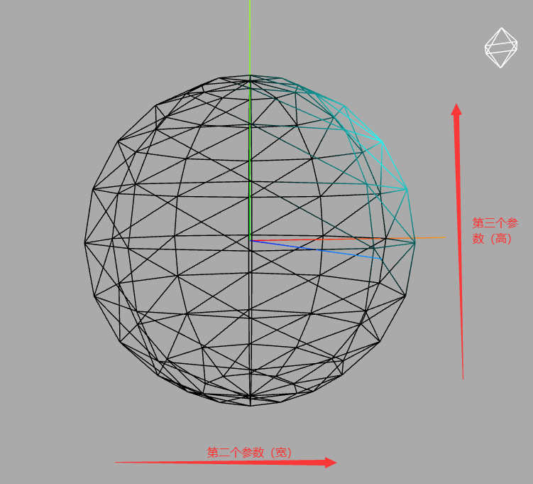
细分数越多，这个球体就会越圆润
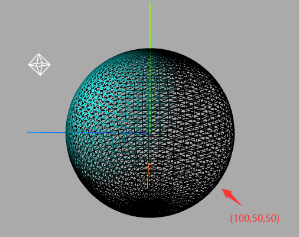

#### 关于三角形的数量和性能
对于一个曲面而言，细分数越大，表面越光滑，但是三角形和顶点数量却越多。
几何体三角形数量或者说顶点数量直接影响Three.js的渲染性能，在不影响渲染效果的情况下，一般尽量越少越好。、


## 旋转、缩放、平移几何体
`BufferGeinetry`几何体可以通过css3属性来进行旋转缩放平移等操作
缩放`.scale()`，平移`.translate()`，旋转`rotateX、Y、Z()`

```javascript
// 长宽高缩放
geometry.scale(2, 2, 2);
// x轴偏移50px
geometry.translate(50, 0, 0);
// 几何体绕着x轴旋转45度
geometry.rotateX(Math.PI / 4);
```
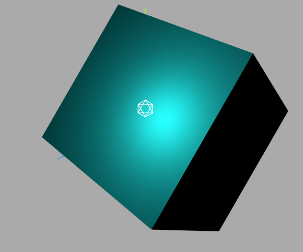

#### 居中`.center()`
如果几何体已经发生了偏移，那么执行ceenter可以重新与坐标原点重合
```js
geometry.center();
```
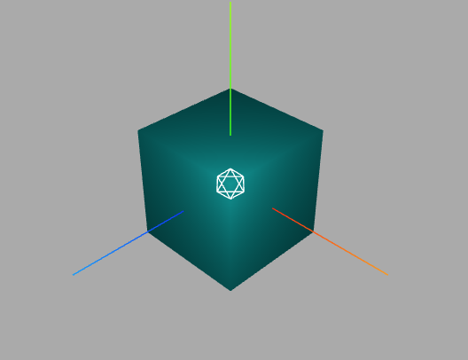