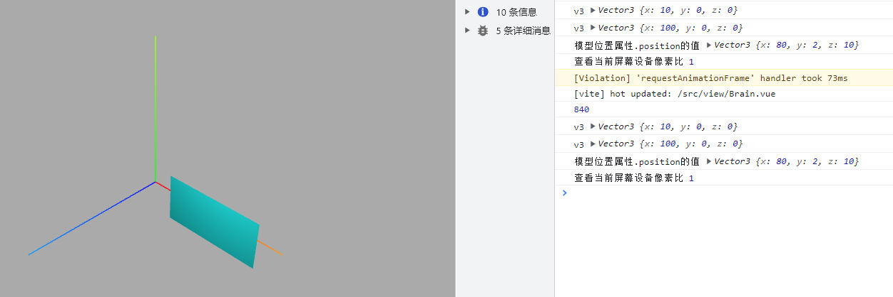
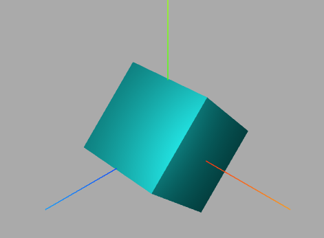
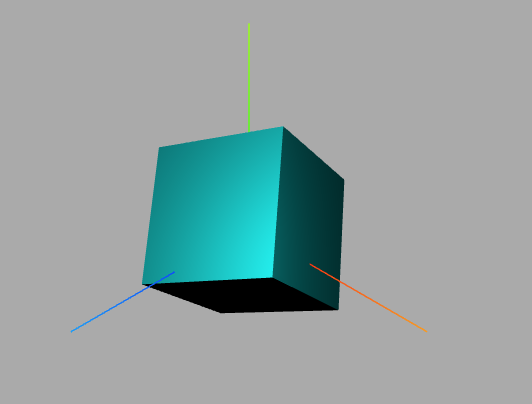
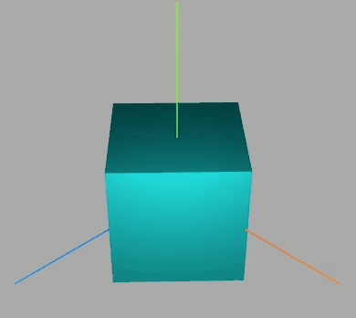
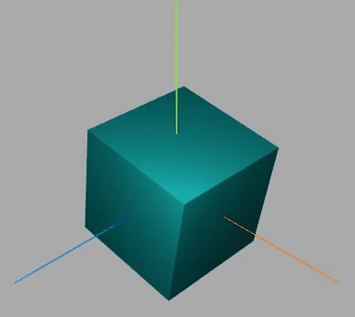
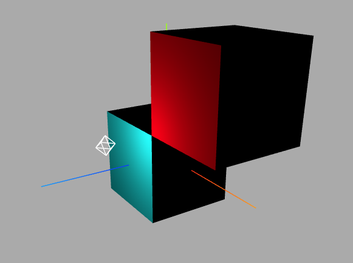

## 模型对象/材质
#### 三维向量 Vector3 与模型位置

该类表示的是一个三维向量（3D vector）。 一个三维向量表示的是一个有顺序的、三个为一组的数字组合（标记为 x、y 和 z）， 可被用来表示很多事物，例如：

- 一个位于三维空间中的点。
- 一个在三维空间中的方向与长度的定义。在 three.js 中，长度总是从(0, 0, 0)到(x, y, z)的 Euclidean distance（欧几里德距离，即直线距离）， 方向也是从(0, 0, 0)到(x, y, z)的方向。
- 任意的、有顺序的、三个为一组的数字组合。
  点、线、网格模型等模型对象的父类都是`Object3D`，如果想对这些模型进行旋转、缩放、平移等操作。如何实现，可以查询 Threejs 文档 Object3D。
  Vector3 对象中具有 x、y、z，此对象还具有`.set()`等方法。

```js
const geometry = new THREE.PlaneGeometry(100, 50);
// 材质
material = new THREE.MeshLambertMaterial({
  color: 0x00ffff,
  transparent: true, //开启透明
  // opacity: 0.5, //设置透明度
  // wireframe: true,//线条模式渲染mesh对应的三角形数据
  side: THREE.DoubleSide, //两面可见
});
geometry.translate(50, 0, 0);
geometry.center();
mesh = new THREE.Mesh(geometry, material);

mesh.position.set(80, 2, 10);
scene.add(mesh);
const v3 = new THREE.Vector3(10, 0, 0);
console.log("v3", v3);
v3.set(10, 0, 0); //set方法设置向量的值
v3.x = 100; //访问x、y或z属性改变某个分量的值
console.log("v3", v3);
console.log("模型位置属性.position的值", mesh.position);
```



#### 改变位置属性

通过模型位置属性`.position`可以设置模型在场景 Scene 中的位置。模型位置`.position`的默认值是`THREE.Vector3(0.0,0.0,0.0)`，表示坐标原点。

设置模型 xyz 坐标

```js
mesh.position.set(80, 2, 10);
```

#### 平移

`.translateX()`、`.translateY()`、`.translateZ()`

```js
mesh.position.set(80, 2, 10);
mesh.translateY(100);
```

#### 欧拉角`Euler`

角度属性`.rotation`的值是欧拉对象`Euler`

```javascript
//绕y轴的角度设置为45度
mesh.rotation.x = Math.PI / 4;
//绕y轴的角度增加0度
mesh.rotation.y += 0;
//绕y轴的角度减去90度
mesh.rotation.z -= Math.PI / 2;
```

绕着 xyz 轴分别旋转 45 度，0 度，90 度


#### 旋转方法`.rotateX()`、`.rotateY()`、`.rotateZ()`

说白了其实`.rotaition`等价于`rotate`方法

```js
mesh.rotation.x = Math.PI / 4;
mesh.rotation.y += 0;
mesh.rotation.z -= Math.PI / 2;
mesh.rotateX(Math.PI / 3); //绕x轴旋转π/3
```

这里`rotateX`会覆盖`mesh.rotation.x`


#### 旋转动画

旋转动画的两种方式

```js
// 渲染循环
function render() {
  mesh.rotation.y += 0.01;
  requestAnimationFrame(render);
}
```

```js
function render() {
  mesh.rotateX(0.01);
}
```

效果如下：


#### 围绕某个轴旋转

此段代码放入动画中
网格模型绕(0,1,0)向量表示的轴旋转π/20。
```js
const axis = new THREE.Vector3(0, 0, 1); //向量axis
mesh.rotateOnAxis(axis, Math.PI / 20); //绕axis轴旋转π/8
```


#### 克隆`.clone`
复制一份和原对象一样的新对象，可以参考这种写法
```js
const v1 = new THREE.Vector3(1, 2, 3);
console.log('v1',v1);
//v2是一个新的Vector3对象，和v1的.x、.y、.z属性值一样
const v2 = v1.clone();
console.log('v2',v2);
```

#### 复制`.copy()`
这里不过多解释了
```js
const v1 = new THREE.Vector3(1, 2, 3);
const v3 = new THREE.Vector3(4, 5, 6);
v3.copy(v1);
console.log(v3) // 1,2,3
```

#### 关于Mesh克隆`.clone()`
```js
 const geometry = new THREE.BoxGeometry(100, 100, 100);
    // const geometry = new THREE.PlaneGeometry(100, 50);
    // 材质
    material = new THREE.MeshLambertMaterial({
      color: 0x00ffff,
    });
    mesh = new THREE.Mesh(geometry, material);

    const mesh2 = mesh.clone();
    // 克隆几何体
    mesh2.geometry = mesh.geometry.clone();
    // 克隆材质
    mesh2.material = mesh.material.clone();
    // 更改mesh2的颜色
    mesh2.material.color.set(0xff0000);
    // 更改mesh2的位置避免重叠
    mesh2.position.set(100, 100, 0)
    scene.add(mesh);
    // 添加进场景
    scene.add(mesh2);
```


