##

#### Group 层级模型

通过 THREE.Group 类创建一个组对象 group,然后通过 add 方法把网格模型 mesh1、mesh2 作为设置为组对象 group 的子对象，然后在通过执行 scene.add(group)把组对象 group 作为场景对象的 scene 的子对象。也就是说场景对象是 scene 是 group 的父对象，group 是 mesh1、mesh2 的父对象。

其实就是在场景上面追加了一层画布，可以将模型放在这个画布中，所以形成了三级结构 scene=>group=>mesh1+mesh2

```js
const geometry = new THREE.BoxGeometry(100, 100, 100);
// 材质
material = new THREE.MeshLambertMaterial({ color: 0x00ffff });
const group = new THREE.Group(); // 创建一个画布
const mesh1 = new THREE.Mesh(geometry, material); // 创建两个相大小和材质的正方体
const mesh2 = new THREE.Mesh(geometry, material);
mesh2.translateX(105);
group.add(mesh1);
group.add(mesh2);
scene.add(group);
```

效果：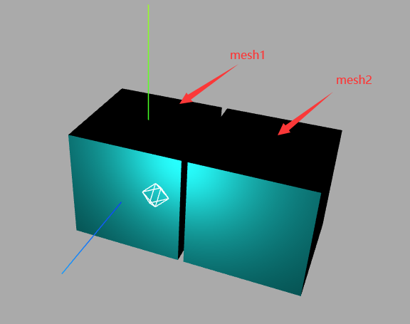

#### group.children

可以查看 group 中存在的对象
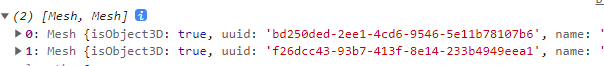

#### scene.children

查看场景对象的结构
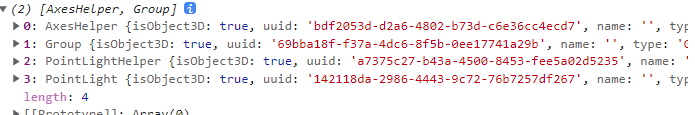
场景对象 Scene 的子对象，除了组对象 Group 之外，还可以看到环境光 AmbientLight、平行光 DirectionalLight、辅助坐标对象 AxesHelper。

#### .add()方法

添加多个场景时，可以简写成

```js
group.add(mesh1, mesh2);
```

#### 父级 group 旋转平移

如果我们这里让 group 这个父级平移旋转缩放等操作，那么所有的子对象也会同样的跟着改变。

```js
group.translateY(100);
```

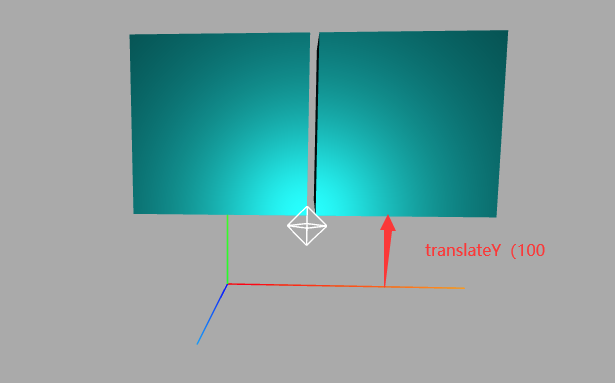

#### `Object3D`模型对象节点

其实它从某种程度上是和 group 一样的，Object3D 是表示模型节点的意思

```js
const geometry = new THREE.BoxGeometry(100, 100, 100);
// 材质
material = new THREE.MeshLambertMaterial({ color: 0x00ffff });
const mesh1 = new THREE.Mesh(geometry, material); // 创建两个相大小和材质的正方体
const mesh2 = new THREE.Mesh(geometry, material);
mesh2.translateX(105);

// mesh = new THREE.Mesh(geometry, material);
const obj = new THREE.Object3D(); //作为mesh1和mesh2的父对象
obj.add(mesh1, mesh2);
obj.translateY(100);
console.log(obj);
scene.add(obj);
```

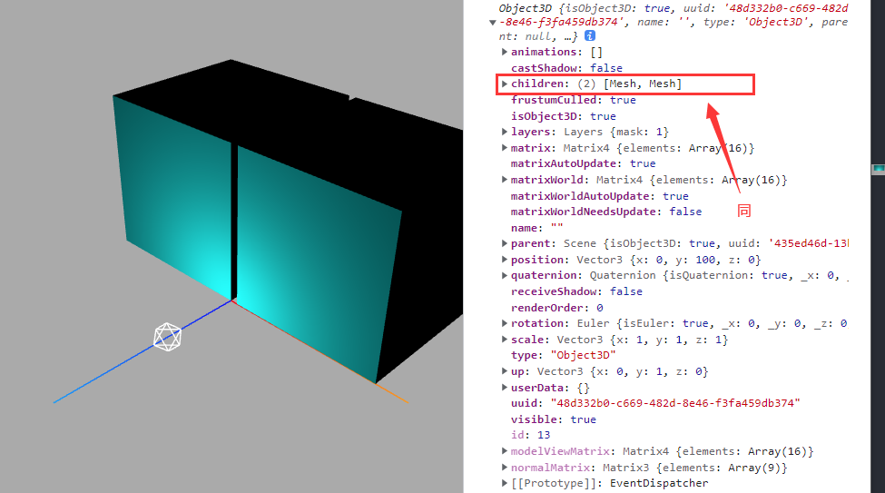

#### 模型嵌套模型(mesh 中添加`mesh2`子对象)

```js
const geometry = new THREE.BoxGeometry(100, 100, 100);
// 材质
material = new THREE.MeshLambertMaterial({ color: 0x00ffff });
const mesh1 = new THREE.Mesh(geometry, material); // 创建两个相大小和材质的正方体
const mesh2 = new THREE.Mesh(geometry, material);
mesh2.translateX(105);
mesh1.add(mesh2);
scene.add(mesh1);
```

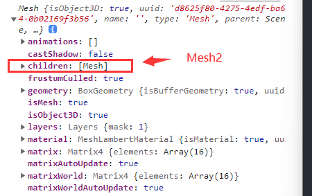

## 遍历模型树结构、查询模型节点

比如我们可以对层级模型对象起个名字来标记这个模型是做什么的

#### `.name`属性

```js
const geometry = new THREE.BoxGeometry(100, 100, 100);
// 材质
material = new THREE.MeshLambertMaterial({ color: 0x00ffff });
group = new THREE.Group();
group.name = "积木房";
const mesh1 = new THREE.Mesh(geometry, material);
mesh1.name = "积木房1层";
const mesh2 = new THREE.Mesh(geometry, material);
mesh2.name = "积木房2层";
mesh2.translateY(101);
group.add(mesh1, mesh2);
scene.add(group);
console.log(group);
```

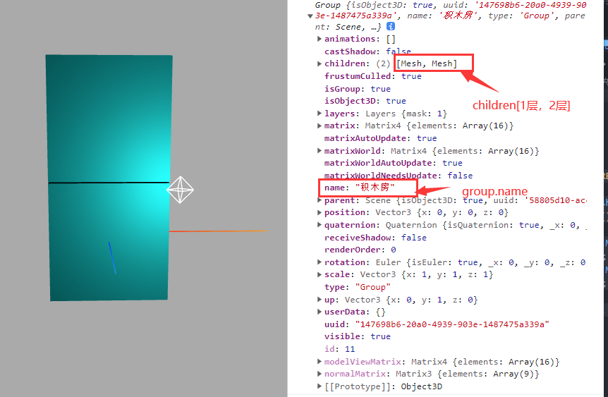

#### 结构模型设置`.name`属性

我们在开发的时候，会优先加载外部的模型，之后要对模型上添加标签锕，标点啊等等，就需要批量给子对象设置节点名称
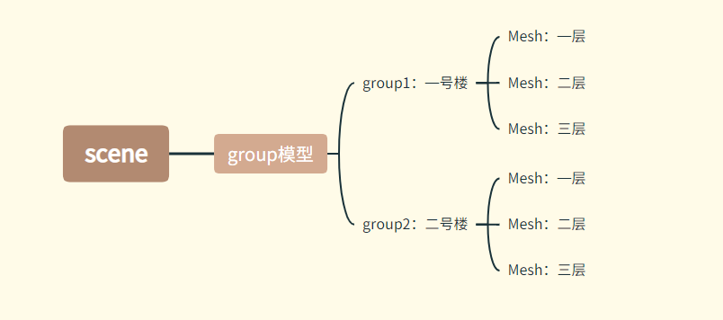

看个例子

```js
const group1 = new THREE.Group();
group1.name = "一号楼";
for (let i = 0; i < 5; i++) {
  const geometry = new THREE.BoxGeometry(20, 60, 10);
  const material = new THREE.MeshBasicMaterial({ color: 0x00ffff });
  const mesh = new THREE.Mesh(geometry, material);
  mesh.position.x = i * 30;
  group1.add(mesh);
  mesh.name = i + 1 + "号楼";
}
group1.position.y = 30;

const group2 = new THREE.Group();
group2.name = "二号楼";
for (let i = 0; i < 5; i++) {
  const geometry = new THREE.BoxGeometry(20, 30, 10);
  const material = new THREE.MeshLambertMaterial({
    color: 0x00ff90,
  });
  const mesh = new THREE.Mesh(geometry, material);
  mesh.position.x = i * 30;
  group2.add(mesh);
  mesh.name = i + 6 + "号楼";
}
group2.position.z = 50;
group2.position.y = 15;

const model = new THREE.Group();
model.name = "小区房子";
model.add(group1, group2);
model.position.set(-50, 0, -25);

console.log(model);
scene.add(model);
```

效果：
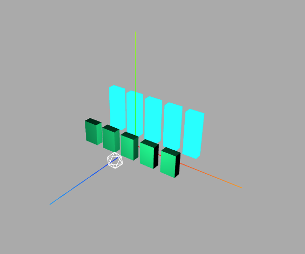
查看结构：
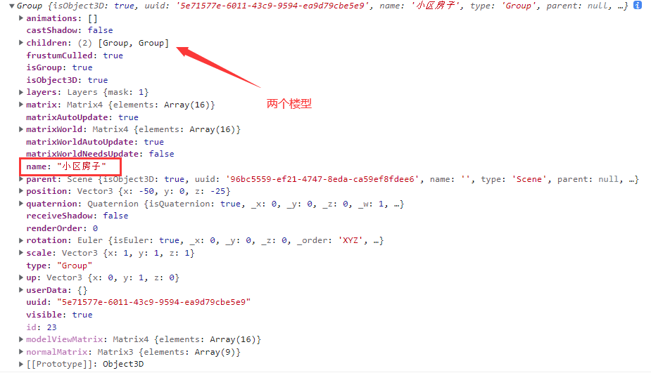
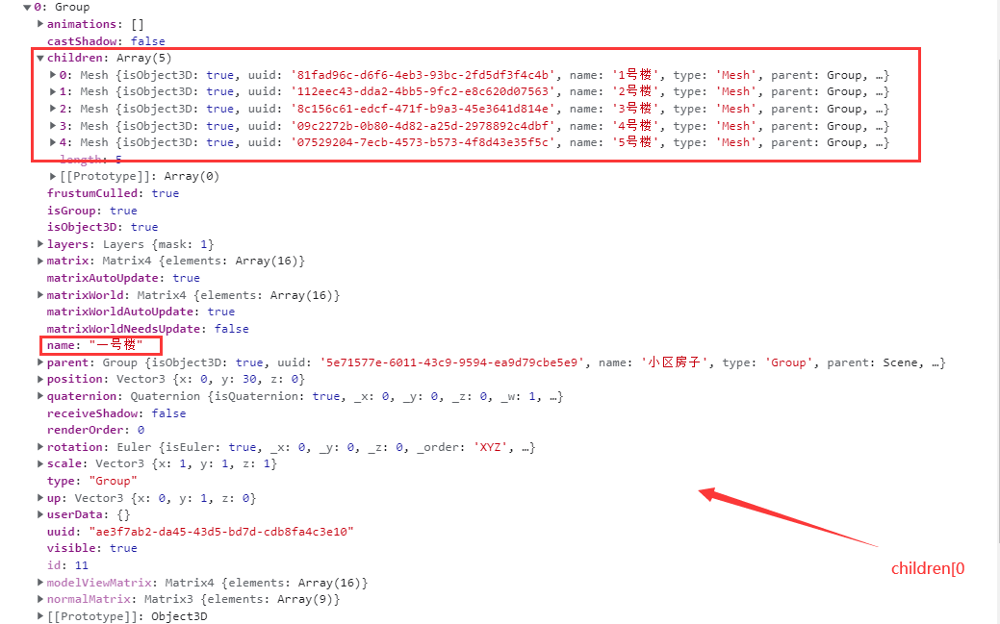

#### traverse方法
```js
    model.traverse(function (obj) {
      console.log("节点名称", obj.name);
      // obj.isMesh：if判断模型对象obj是不是网格模型'Mesh'
      if (obj.isMesh) {
        //判断条件也可以是obj.type === 'Mesh'
        obj.material.color.set(0xffff00);
      }
    });
```
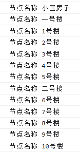

#### 查找具体的某个模型`.getObjectByName()`
用`.getObjectByName()`方法可以通过name获取dom元素
```js
    const nameNode = scene.getObjectByName('6号楼');
    console.log(nameNode);
    nameNode.material.color.set(0xfc2000)
```
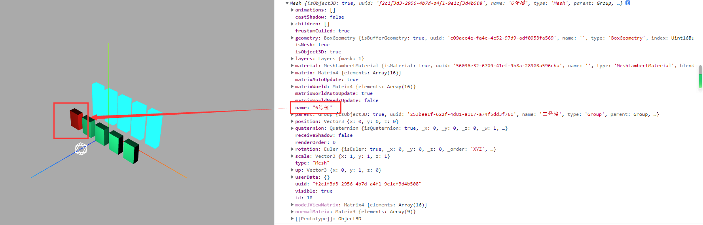