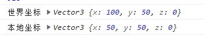
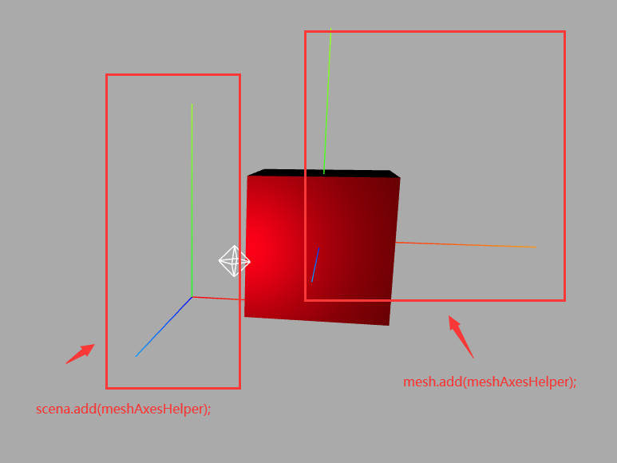
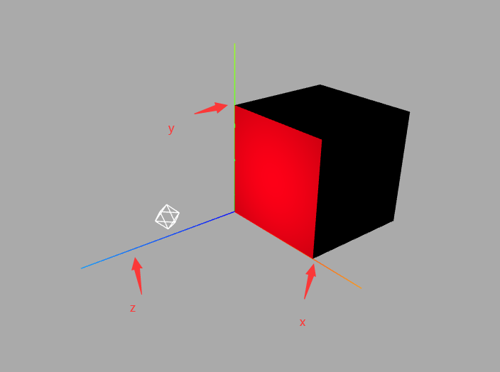
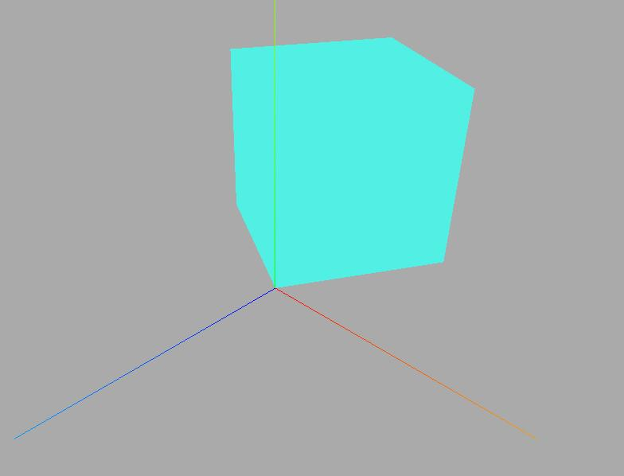
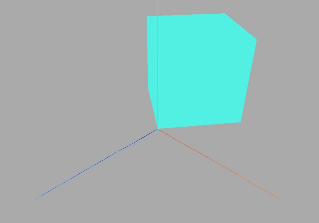
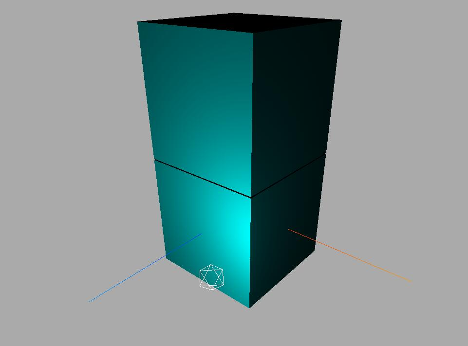
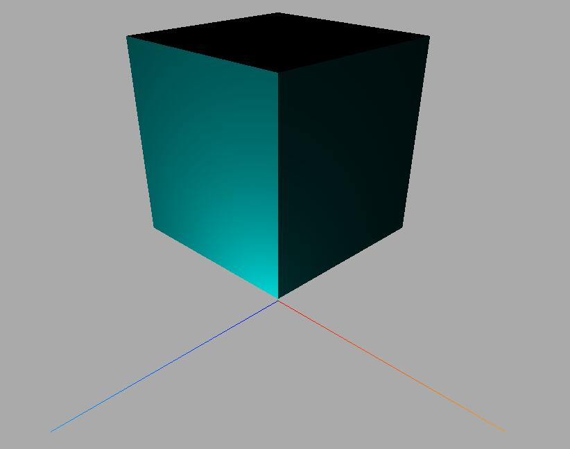

## 世界坐标`.getWorldPosition()`
基础坐标也就是模型的`.position`属性
世界坐标：就是模型资深`.position`和所有父对象`.position`累加的坐标

用`.getWorldPosition()`属性需要用三维向量表示摸个坐标后方可读取
例如：
```javascript
    const geometry = new THREE.BoxGeometry(100, 100, 100);
    const material = new THREE.MeshLambertMaterial({
      color: 0xff0000,
    });
    const mesh = new THREE.Mesh(geometry, material);
    mesh.position.set(50, 50, 0);
    const group = new THREE.Group();
    group.add(mesh);
    group.position.set(50, 0, 0);
    scene.add(group);
    const worldPosition = new THREE.Vector3();
    mesh.getWorldPosition(worldPosition);
    console.log("世界坐标", worldPosition);
    console.log("本地坐标", mesh.position);
```



这里是简单的添加了一个层级模型`group`， 模型默认是以原点为中心，所以要把他拿到X、Y轴上方就给他加一半的坐标，之后将父级`group`在往X轴再加50可以看到，世界坐标是把所有的父级对象都给累加起来了。

当然也是可以给mesh或者group添加坐标系的
```js
    const axesHelper = new THREE.AxesHelper(150);
    mesh.add(axesHelper);
2
00


## 改变模型坐标原点的位置
使用 `translate`平移
```javascript
    const geometry = new THREE.BoxGeometry(100, 100, 100);
    geometry.translate(100/2,100/2,-100/2);
    const material = new THREE.MeshLambertMaterial({
      color: 0xff0000,
    });
    const mesh = new THREE.Mesh(geometry, material);
    scene.add(mesh);
```


使用旋转来查看效果：
```js
 mesh.rotateY(Math.PI/3);
```



设置旋转动画属性
```js
  function animate() {
    mesh.rotateY(0.01);//旋转动画
    requestAnimationFrame(animate);
    renderer.render(scene, camera);
  }
```




## 删除模型对象`.remove`
这里跟js中的remove()方法一致，选择对应的父节点删除里面的子节点即可
我们拿之前的例子演示一下：
```html
<!-- author: Mr.J -->
<!-- date: 2023-04-12 11:43:45 -->
<!-- description: Vue3+JS代码块模板 -->
<template>
  <div class="container" ref="container">
  </div>
</template>

<script setup>
import * as THREE from "three";
// 轨道
import { OrbitControls } from "three/examples/jsm/controls/OrbitControls";
import { ref, reactive, onMounted } from "vue";
// 三个必备的参数
let scene, camera, renderer, controls, mesh, group, material ;

onMounted(() => {
  // 外层需要获取到dom元素以及浏览器宽高，来对画布设置长宽
  // clientWidth等同于container.value.clientWidth
  let container = document.querySelector(".container");
  const { clientWidth, clientHeight } = container;
  console.log(clientHeight);

  init();
  animate();
  // 首先需要获取场景，这里公共方法放在init函数中
  function init() {
    scene = new THREE.Scene();
    // 给相机设置一个背景
    scene.background = new THREE.Color(0xaaaaaa);
    // 透视投影相机PerspectiveCamera
    // 支持的参数：fov, aspect, near, far
    camera = new THREE.PerspectiveCamera(
      60,
      clientWidth / clientHeight,
      0.1,
      1000
    );
    // 相机坐标
    camera.position.set(200, 200, 200);
    // 相机观察目标
    camera.lookAt(scene.position);
    // 渲染器
    renderer = new THREE.WebGLRenderer();
    // 渲染多大的地方
    renderer.setSize(clientWidth, clientHeight);
    container.appendChild(renderer.domElement);
    controls = new OrbitControls(camera, renderer.domElement);
    const axesHelper = new THREE.AxesHelper(150);
    scene.add(axesHelper);
    addBox();
    const pointLight = new THREE.PointLight(0xffffff, 1.0);
    // pointLight.position.set(400, 0, 0);//点光源放在x轴上
    pointLight.position.set(60, 20, 100); //设置光源的位置
    // 光源和网格模型Mesh对应一样是三维场景的一部分，自然需要添加到三维场景中才能起作用。
    scene.add(pointLight); // 添加光源到场景中
    const pointLightHelper = new THREE.PointLightHelper(pointLight, 10);
    scene.add(pointLightHelper);
    // scene.remove(pointLightHelper);
   
  }

  function addBox() {
    const geometry = new THREE.BoxGeometry(100, 100, 100);
    // 材质
    material = new THREE.MeshLambertMaterial({ color: 0x00ffff });
    group = new THREE.Group();
    group.name = "积木房";
    const mesh1 = new THREE.Mesh(geometry, material);
    mesh1.name = "积木房1层";
    const mesh2 = new THREE.Mesh(geometry, material);
    mesh2.name = "积木房2层";
    mesh2.translateY(101);
    group.add(mesh1, mesh2);
    scene.add(group);
    console.log(group);
    // group.remove(mesh1)
  }
  function animate() {
    requestAnimationFrame(animate);
    renderer.render(scene, camera);
  }
});
</script>

<style>
.container {
  width: 100%;
  height: 100vh;
  position: relative;
  z-index: 1;
}
</style>


```

这里移除其中一个
```js
group.remove(mesh1)
// scene.remove(pointLightHelper); 移除环境光
```



## 模型显示隐藏 `.visible`

```js
mesh.visible =false;// 隐藏一个网格模型，visible的默认值是true
group.visible =false;// 隐藏一个包含多个模型的组对象group
```