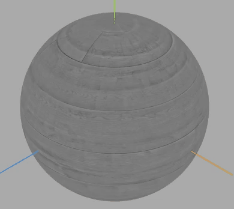

## 创建纹理贴图

```js
const geometry = new THREE.PlaneGeometry(100, 100);
//纹理贴图加载器TextureLoader
const texLoader = new THREE.TextureLoader();
// .load()方法加载图像，返回一个纹理对象Texture
const texture = texLoader.load(
  new URL(`../assets/img/zhizhen.png`, import.meta.url).href
);
const material = new THREE.MeshLambertMaterial({
  //  color:0x00ffff,
  // 设置纹理贴图：Texture对象作为材质map属性的属性值
  map: texture, //map表示材质的颜色贴图属性
});
```

color 和 map 同时使用会出现重叠混合的现象，最好就是设置了 color 就不用设置 map，设置 map 就不用设置 color。color 的默认颜色为白色

尝试不同形状的模型

```js
const geometry = new THREE.BoxGeometry(100, 100, 100); //长方体
```

效果：


```js
const geometry = new THREE.SphereGeometry(50, 50, 50); //长方体
```


## 顶点 UV 坐标

```js
const uvs = new Float32Array([0, 1, 1, 1, 0, 0, 1, 0]);
geometry.attributes.uv = new THREE.BufferAttribute(uvs, 2);
```
这里的2代表2个为一组

#### 获取纹理贴图四分之一

```js
const uvs = new Float32Array([0, 0.5, 0.5, 0.5, 0, 0, 0.5, 0]);
geometry.attributes.uv = new THREE.BufferAttribute(uvs, 2);
```


## 圆形平面设置纹理贴图
如果创建了一个圆形几何体`CircleGeometry`，将图片作为圆形的材质贴图，那么他就会将一张方形图片剪切渲染为圆形效果
```js
    const geometry = new THREE.CircleGeometry(100, 100);
    const textureLoader = new THREE.TextureLoader();
    const material = new THREE.MeshBasicMaterial({
      color:0xfff000,
      map: textureLoader.load(
        new URL(`../assets/img/zhizhen.png`, import.meta.url).href
      ),
      // transparent: true,
      side: THREE.DoubleSide, //两面可见
    });
    const mesh = new THREE.Mesh(geometry, material);
    mesh.position.y = 100;
    mesh.position.x = 100;
    scene.add(mesh);
```
效果如下：

#### 原理
`CircleGeometry`的UV坐标会对颜色纹理贴图.map进行提取，`CircleGeometry`的UV坐标默认提取的就是一个圆形轮廓。

## 纹理对象Texture阵列
使用threejs纹理对象Texture的阵列功能+矩形平面几何体PlaneGeometry实现一个地面瓷砖效果。
```js
 const geometry = new THREE.PlaneGeometry(100, 100);
    const texLoader = new THREE.TextureLoader();
    const texture = texLoader.load( new URL(`../assets/img/zhizhen.png`, import.meta.url).href);
    const material = new THREE.MeshBasicMaterial({
      map: texture,
    });
    texture.wrapS = THREE.RepeatWrapping;
    texture.wrapT = THREE.RepeatWrapping;
    texture.repeat.set(12, 12);
    const mesh = new THREE.Mesh(geometry, material);
    scene.add(mesh);
```


texture.wrapS是WebGL中纹理对象的属性之一，用于指定纹理在水平方向上的重复方式。它可以设置为以下值之一：

* gl.REPEAT：纹理在水平方向上重复。
* gl.CLAMP_TO_EDGE：纹理在水平方向上被截断，超出部分被拉伸到边缘像素。
- gl.MIRRORED_REPEAT：纹理在水平方向上重复，但是每次重复时都会翻转纹理。
例如，设置texture.wrapS = gl.REPEAT可以使纹理在水平方向上重复，从而实现无缝平铺的效果。需要注意的是，纹理的wrapS和wrapT属性分别控制纹理在水平和垂直方向上的重复方式。

## 旋转矩形平面
注意旋转方向影响矩形平面背面还是正面朝上，threejs默认渲染正面，不渲染背面。
```js
// 旋转矩形平面
mesh.rotateX(-Math.PI/2);
```


## 背景透明 png 贴图

把一个背景透明的.png 图像作为平面矩形网格模型 Mesh 的颜色贴图是一个非常有用的功能，通过这样一个功能，可以对 three.js 三维场景进行标注

我们这里换成一个矩形进行测试

```js
const geometry = new THREE.PlaneGeometry(100, 100);
const textureLoader = new THREE.TextureLoader();
const material = new THREE.MeshBasicMaterial({
  map: textureLoader.load(
    new URL(`../assets/img/zhizhen.png`, import.meta.url).href
  ),
  transparent: true, // 开启透明
  side: THREE.DoubleSide, //两面可见
});
const mesh = new THREE.Mesh(geometry, material);
scene.add(mesh);
```

效果：


## 网格地面辅助观察`GridHelper`

旋转 90°

```js
mesh.rotateX(-Math.PI / 2);
```

```js
const gridHelper = new THREE.GridHelper(300, 25, 0x004444, 0x004444);
scene.add(gridHelper);
```

如果不想开启透明则会成为颜色贴图

```js
const geometry = new THREE.PlaneGeometry(100, 100);
const textureLoader = new THREE.TextureLoader();
const material = new THREE.MeshBasicMaterial({
  map: textureLoader.load(
    new URL(`../assets/img/zhizhen.png`, import.meta.url).href
  ),
});
const mesh = new THREE.Mesh(geometry, material);
scene.add(mesh);
```


## 旋转矩形平面

```js
mesh.rotateX(-Math.PI / 2);
```

如果不想与地面网格重叠，那么给平面设置`.position`偏移则可不与地面进行重合

```js
mesh.position = 1;
```

## 关于动画
这里说一下纹理图旋转动画

#### 旋转球体纹理贴图
#### 纹理对象.wrapS或.wrapT与.offset组合使用
当你在动画方法中设置offset偏移后，需要将`.wrapS`或者`.wrapT`设置为重复映射
下面是对比效果

直接加偏移量
```js
  const render = () => {
    texture.offset.x += 0.001;
    renderer.render(scene, camera);
    requestAnimationFrame(render);
  };
```
效果：

偏移量+纹理映射
```js
  texture.offset.x += 0.5; 
  texture.wrapS = THREE.RepeatWrapping; // 对应offste.x偏移
  /* 或 */
  // texture.offset.y +=0.5;//纹理V方向偏移
  // texture.wrapT = THREE.RepeatWrapping;//对应offste.y偏移
```
效果：

可以看到第一种方法旋转一圈后就会出现问题，后续就无法重复映射。

## 纹理贴图阵列 + UV动画
通过阵列纹理贴图设置`.map`,这样的话贴图像素可以更小一些。

```js
 const geometry = new THREE.PlaneGeometry(500, 500);
    const texLoader = new THREE.TextureLoader();
    texture = texLoader.load(
      new URL(`../assets/img/zhizhen.png`, import.meta.url).href
    );
    const material = new THREE.MeshBasicMaterial({
      // color:0xfff000,
      map: texture,
      // transparent: true,
      // side: THREE.DoubleSide, //两面可见
    });
    texture.wrapS = THREE.RepeatWrapping;
    texture.wrapT = THREE.RepeatWrapping;
    // uv两个方向纹理重复数量
    texture.repeat.x = 5; //注意选择合适的阵列数量
    texture.repeat.y = 5; //注意选择合适的阵列数量
    const mesh = new THREE.Mesh(geometry, material);
    mesh.rotateX(-Math.PI / 2);
    scene.add(mesh);
```
```js
  const render = () => {
    texture.offset.x += 0.01;
    texture.offset.y += 0.01;
    renderer.render(scene, camera);
    requestAnimationFrame(render);
  };
  render();
```
