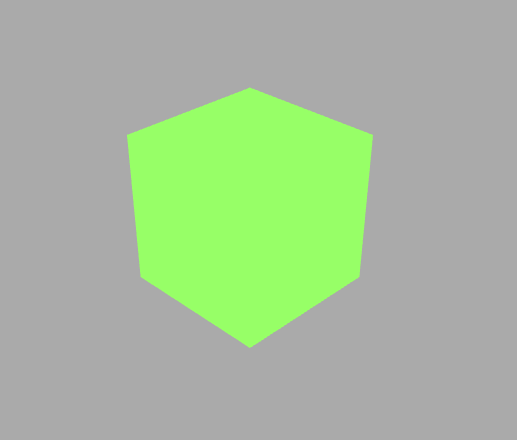
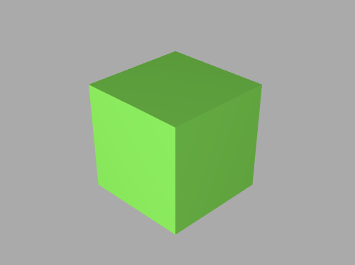
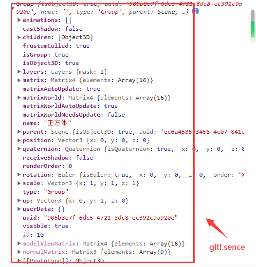
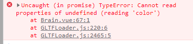
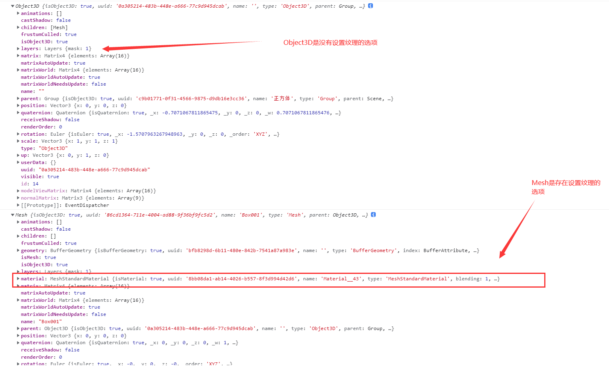
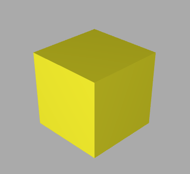
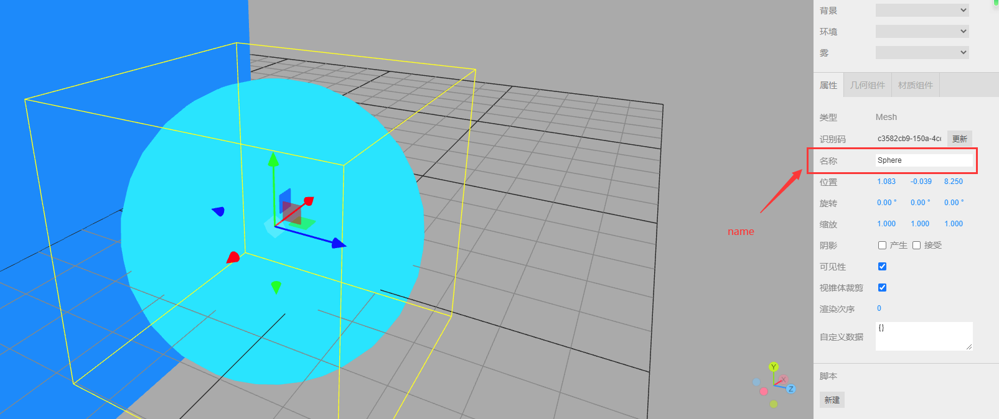
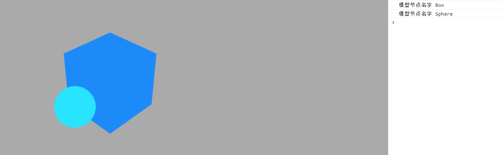
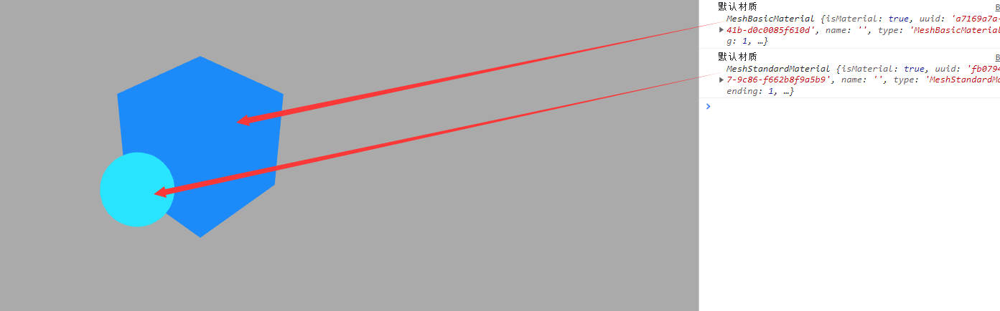
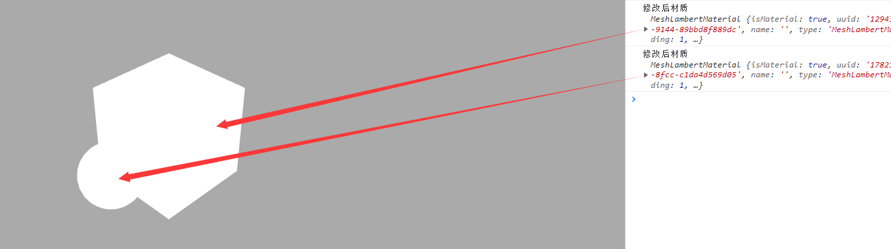

# Threejs——十、关于 gltf 模型的介绍、引入方法以及设置属性添加功能（结尾附代码）

## 关于 gltf 模型的介绍、引入方法以及设置属性添加功能（结尾附代码）

### 绘制模型

前端推荐使用 Blender 三维建模软件，模型推荐使用 gltf 或者 glb 文件。
后续会更新 Blender 的使用方法

### `gltf`

glTF（GL Transmission Format）是一种用于传输和加载 3D 模型的开放标准格式。它是由 Khronos Group 开发的，旨在提供一种轻量级、高效、可扩展的 3D 模型格式，以便在 Web 和移动设备等平台上实现快速加载和渲染。glTF 格式支持包括几何体、材质、纹理、动画和场景等多种 3D 模型元素，并且可以使用 JSON 格式进行序列化和压缩，从而减少文件大小和加载时间。glTF 格式还支持 PBR（Physically Based Rendering）渲染流程，可以实现更真实的光照和材质效果。由于其开放性和高效性，glTF 格式已经被广泛应用于 Web 和移动设备等领域，成为了一种重要的 3D 模型传输和加载标准。

#### 加载 gltf 文件

引入扩展库

```js
// 引入gltf模型加载库GLTFLoader.js
import { GLTFLoader } from "three/addons/loaders/GLTFLoader.js";
```

#### 实例化一个 gltf 加载器

```js
const loader = new GLTFLoader();
```

#### gltf 加载器方法`.load()`

```js
loader.load("模型名称.gltf", function (gltf) {
  console.log("控制台查看加载gltf文件返回的对象结构", gltf);
  console.log("gltf对象场景属性", gltf.scene);
  // 返回的场景对象gltf.scene插入到threejs场景中
  scene.add(gltf.scene);
});
```

<strong style="color:#f00">关于会出现模型是黑色的情况，存在两种可能：</strong>

1. 这时需要在成功函数中添加`traverse`函数设置材质和贴图

```js
gltf.scene.traverse(function (child) {
    if (child.isMesh) {
        child.frustumCulled = false;
        //模型阴影
        child.castShadow = true;
        //模型自发光
        child.material.emissive = child.material.color;
        child.material.emissiveMap = child.material.map;
    }
}
```

效果如下：
 2. 通过添加光源来渲染模型

```js
// 光源
const linght = () => {
  const pointLight = new THREE.PointLight(0xffffff, 1.0);
  pointLight.position.set(50, 50, 100);
  const pointLightHelper = new THREE.PointLightHelper(pointLight, 10);
  scene.add(pointLightHelper);
  scene.add(pointLight);
};
```

效果：


注意：我这里的模型长宽高的比例是(10,10,10)，所以将相机镜头调整到合适大小即可，推荐`camera.position`值为(30,30,30)

```js
camera.position.set(30, 30, 30);
```

## 观察相机位置变化`OrbitControls`改变相机.`lookAt`观察目标

通过`OrbitControls`平移，`OrbitControls`的`.target`属性会发生变化，`.target`属性对应的就是透视投影相机`PerspectiveCamera`的`.lookAt`观察目标`。

放在相机控件中查看，当触发模型的 change 事件时可在控制台查看数值的变化

```js
// 相机控件
const control = () => {
  controls = new OrbitControls(camera, renderer.domElement);
  controls.addEventListener("change", function () {
    // 浏览器控制台查看controls.target变化，辅助设置lookAt参数
    console.log("controls.target", controls.target);
    // 浏览器控制台查看相机位置变化
    console.log("camera.position", camera.position);
  });
};
control();
```

## gltf 生成不同的文件形式(glb)

1. 单独的 gltf 模型文件
2. 单独的 glb 模型文件
3. gltf + bin + 贴图文件
   正常加载就可以，但路径不要动，以免出现错乱

```js
const loader = new GLTFLoader();
loader.load(
  new URL(`../assets/111.gltf`, import.meta.url).href,
  function (gltf) {
    scene.add(gltf.scene);
    gltf.scene.traverse(function (child) {
      if (child.isMesh) {
        child.frustumCulled = false;
        //模型阴影
        child.castShadow = true;
        //模型自发光
        child.material.emissive = child.material.color;
        child.material.emissiveMap = child.material.map;
      }
    });
  },
  function (xhr) {
    // 后台打印查看模型文件加载进度
    console.log("加载完成的百分比" + (xhr.loaded / xhr.total) * 100 + "%");
  },
  function (err) {
    console.error("加载发生错误");
  }
);
```

浏览器控制台查看 3D 模型树结构

```js
console.log(gltf.scene);
```

添加 name 名称

```js
console.log(gltf.scene);
gltf.scene.name = "正方体";
```



## `.getObjectByName()`根据`.name`获取模型节点

```js
gltf.scene.name = "正方体";
const nameNode = gltf.scene.getObjectByName("正方体");
console.log(nameNode);
nameNode.material.color.set(0xfff000);
```

这里不可以直接更改 material 的颜色


原因是 Object3D 属性中是不存在`material`的所以我们需要更准确的判断他的类型

```js
gltf.scene.traverse(function (child) {
  console.log(child);
  if (child.isMesh) {
    child.material.color.set(0xfff000);
  }
});
```



## 递归遍历层级模型修改材质

如果想修改多个 Mesh 材质,用递归遍历方法`.traverse()`批量操作

```js
gltf.scene.traverse(function (child) {
  if (child.isMesh) {
    console.log("模型节点名字", child.name);
  }
});
```

这个名称可以在创建建模的时候起名，也可以自己定义`name`
可以使用 three 自带的编辑器[https://threejs.org/editor/](https://threejs.org/editor/)



## 递归遍历所有模型节点批量修改材质

```js
// 递归遍历所有模型节点批量修改材质
gltf.scene.traverse(function (obj) {
  if (obj.isMesh) {
    console.log("gltf默认材质", obj.material);
  }
});
```



#### 批量修改`Mesh`材质

```js
gltf.scene.traverse(function (child) {
  if (child.isMesh) {
    child.material = new THREE.MeshLambertMaterial({
      color: 0xffffff,
    });
  console.log("修改后材质", child.material);
}

```
```js
  // 环境光源
  const linght = () => {
  const pointLight = new THREE.AmbientLight(0xffffff, 1.0);
    pointLight.position.set(10, 10, 20);
    scene.add(pointLight);
  };
  linght();
```


完整代码如下：

```html
<!-- author: Southern Wind -->
<template>
  <div class="container" ref="container"></div>
</template>

<script setup>
import * as THREE from "three";
// 轨道
import { OrbitControls } from "three/examples/jsm/controls/OrbitControls";
import { GLTFLoader } from "three/addons/loaders/GLTFLoader.js";
import { ref, reactive, onMounted } from "vue";
// 三个必备的参数
let scene, camera, renderer, controls, mesh, material, group, texture;

onMounted(() => {
  // 外层需要获取到dom元素以及浏览器宽高，来对画布设置长宽
  // clientWidth等同于container.value.clientWidth
  let container = document.querySelector(".container");
  const { clientWidth, clientHeight } = container;
  console.log(clientHeight);

  // 首先需要获取场景，这里公共方法放在init函数中
  const init = () => {
    scene = new THREE.Scene();
    // 给相机设置一个背景
    scene.background = new THREE.Color(0xaaaaaa);
    // 透视投影相机PerspectiveCamera
    // 支持的参数：fov, aspect, near, far
    camera = new THREE.PerspectiveCamera(
      60,
      clientWidth / clientHeight,
      0.001,
      6000
    );
    // 相机坐标
    camera.position.set(30, 30, 30);

    // 相机观察目标
    camera.lookAt(scene.position);
    // 渲染器
    renderer = new THREE.WebGLRenderer({
      antialias: true,
    });
    // 渲染多大的地方
    renderer.setSize(clientWidth, clientHeight);
    renderer.outputEncoding = THREE.sRGBEncoding;
    // const axesHelper = new THREE.AxesHelper(150);
    // scene.add(axesHelper);
    container.appendChild(renderer.domElement);
    addBox();
    console.log("查看当前屏幕设备像素比", window.devicePixelRatio);
  };
  init();
  function addBox() {
    const loader = new GLTFLoader();
    loader.load(
      new URL(`../assets/scene (3).glb`, import.meta.url).href,
      function (gltf) {
        console.log(gltf.scene);
        gltf.scene.name = "正方体";
        const nameNode = gltf.scene.getObjectByName("正方体");
        console.log(nameNode);
        // nameNode.material.color.set(0xfff000)
        gltf.scene.traverse(function (child) {
          // console.log(child);
          if (child.isMesh) {
            // child.material.color.set(0xfff000)
            child.material = new THREE.MeshLambertMaterial({
              color: 0xffffff,
            });
            console.log("修改后材质", child.material);
          }
        });
        scene.add(gltf.scene);
      },
      function (xhr) {
        // 后台打印查看模型文件加载进度
        console.log("加载完成的百分比" + (xhr.loaded / xhr.total) * 100 + "%");
      },
      function (err) {
        console.error("加载发生错误");
      }
    );
  }

  // 相机控件
  const control = () => {
    controls = new OrbitControls(camera, renderer.domElement);
    controls.addEventListener("change", function () {
      // 浏览器控制台查看controls.target变化，辅助设置lookAt参数
      console.log("controls.target", controls.target);
      // 浏览器控制台查看相机位置变化
      console.log("camera.position", camera.position);
    });
  };
  control();

  // 光源
  const linght = () => {
    const pointLight = new THREE.AmbientLight(0xffffff, 1.0);
    pointLight.position.set(10, 10, 20);
/*     const pointLightHelper = new THREE.PointLightHelper(pointLight, 1);
    scene.add(pointLightHelper); */
    scene.add(pointLight);
  };
  linght();
  const render = () => {
    renderer.render(scene, camera);
    requestAnimationFrame(render);
  };
  render();
  window.addEventListener("resize", () => {
    // 更新摄像头
    camera.aspect = window.innerWidth / window.innerHeight;
    camera.updateProjectionMatrix();
    renderer.setSize(window.innerWidth, window.innerHeight);
  });
});
</script>

<style>
.container {
  width: 100%;
  height: 100vh;
  position: relative;
  z-index: 1;
}
</style>

```