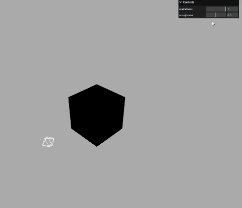

## Three.js——十一、PBR材质金属度、粗糙度以及环境贴图的使用
## `metalness`金属度
金属度属性.metalness表示材质像金属的程度, 非金属材料,如木材或石材,使用0.0,金属使用1.0。
```js
new THREE.MeshStandardMaterial({
    metalness: 1.0,//金属度属性
})
// 或者
// mesh.material.metalness = 1.0;//金属度
```
```js
    const geometry = new THREE.BoxGeometry(10, 10, 10);
    // 材质
    const material = new THREE.MeshStandardMaterial({
      color: 0x51efe4, 
      metalness: 1,
    });
    const mesh = new THREE.Mesh(geometry, material);
    mesh.position.set(0, 0, 0);
    scene.add(mesh);
    // mesh.material.metalness = 1;
    gui = new GUI();
    gui.add(material, "metalness", 0, 1);
```

## `roughness`粗糙度
粗糙度`roughness`表示模型表面的光滑或者说粗糙程度，越光滑镜面反射能力越强，越粗糙，表面镜面反射能力越弱，更多地表现为漫反射。
粗糙度`roughness`,0.0表示平滑的镜面反射,1.0表示完全漫反射,默认0.5。
```js
    const geometry = new THREE.BoxGeometry(10, 10, 10);
    // 材质
    textureCube = new THREE.CubeTextureLoader()
      .setPath(new URL("@/assets/", import.meta.url).href)
      .load(["/02.png", "/02.png", "/02.png", "/02.png", "/02.png", "/02.png"]);
    const material = new THREE.MeshStandardMaterial({
      color: 0x51efe4, //0x51efe4设置材质颜色
      metalness: 1,
      roughness: 0.5,
      envMap: textureCube,
    });
    const mesh = new THREE.Mesh(geometry, material);
    mesh.position.set(0, 0, 0);

    scene.add(mesh);
    // mesh.material.metalness = 1;
    gui = new GUI();
    gui.add(material, "metalness", 0, 1);
    gui.add(material, "roughness", 0, 1);
```
测试图片

实际效果如下：


## `envMapIntensity`环境贴图反射率
用于设置环境贴图的强度。它控制着环境贴图对物体表面的反射程度，数值越大反射越强烈，数值越小反射越弱。该属性的取值范围为0到1之间，默认值为1。

总结：粗糙度越小，反射效果越强，如果设置为0，那么他将完全镜面反射，等同于镜子。
当然在实际开发中，环境贴图的不同也会对渲染效果造成影响，也需要选择合适的贴图，往往这种贴图可以让美术提供即可。


## 纹理和渲染器颜色空间一致
```js
textureCube.encoding = THREE.sRGBEncoding; 
```

## 关于模型的环境贴图`environment`
```js
loader.load(new URL(`../assets/model.glb`, import.meta.url).href, function (gltf) {
    // 递归遍历批量设置环境贴图
    gltf.scene.traverse(function (obj) {
        if (obj.isMesh) { //判断是否是网格模型
            obj.material.envMap = textureCube; //设置环境贴图
        }
    });
})
```

如果想使用环境贴图对scene所有Mesh添加贴图材质，可以通过Scene的场景环境属性.environment实现,把环境贴图对应纹理对象设置为.environment的属性值即可。
```js
scene.environment = textureCube;
```

## `encoding`设置纹理的编码方式
encoding`纹理的颜色值如何被编码和解码，以确保正确的颜色显示。常见的编码方式包括sRGB、Linear和RGBE等。不同的编码方式适用于不同的场景和需求。在使用纹理时，需要根据实际情况选择合适的编码方式。
```js
//如果renderer.outputEncoding=THREE.sRGBEncoding;环境贴图需要保持一致
textureCube.encoding = THREE.sRGBEncoding;   
```