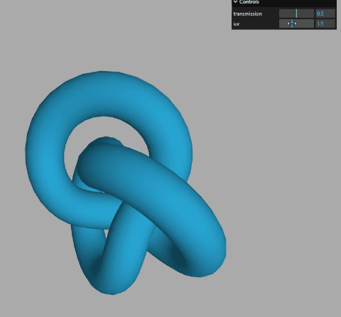

# Three.js——十二、MeshPhysicalMaterial清漆层、粗糙度、物理材质透光率以及折射率（结尾附代码）

## 环境贴图作用测试
#### `MeshPhysicalMaterial`清漆层

`MeshPhysicalMaterial`和`MeshStandarMaterial`都是拥有金属度`metalness`、粗糙度`roughness`属性的PBR材质，`MeshPhysicalMaterial`是`MeshStandarMaterial`的子集，除了继承了他的这些属性以外，还新增了清漆、透光率、反射率、光泽、折射率等等

#### 清漆层属性`.clearcoat`
清漆层属性`.clearcoat`可以用来模拟物体表面刷了一层透明的模`.clearcoat`的范围0到1，默认0。
```js
const material = new THREE.MeshPhysicalMaterial( {
	clearcoat: 1.0,//物体表面清漆层或者说透明涂层的厚度
} );
```
#### 关于MeshPhysicalMaterial材质
`MeshPhysicalMaterial`是Three.js中的一种材质类型，它是基于物理的渲染（PBR）材质，可以模拟真实世界中的光照和材质反射。它支持金属和非金属材质，可以设置粗糙度、金属度、环境光遮蔽、法线贴图、位移贴图等属性，以实现更真实的渲染效果。`MeshPhysicalMaterial`还支持高光反射和透明度，可以用于创建逼真的玻璃、水、金属等材质。在使用`MeshPhysicalMaterial`时，需要注意其计算量较大，可能会影响性能，因此需要根据实际情况进行优化。

#### 清漆层粗糙度`.clearcoatRoughness`
是指表面透明图层的粗糙程度范围是0-1。


#### 使用场景
这种效果可以用来做车子的模型，比如车窗，外壳，玻璃等。
车外壳油漆效果，你可以通过PBR材质的清漆层属性`.clearcoat`和清漆层粗糙度.`clearcoatRoughness`属性模拟。
```js
const mesh = gltf.scene.getObjectByName('外壳');
mesh.material = new THREE.MeshPhysicalMaterial( {
	clearcoat: 1.0,//物体表面清漆层或者说透明涂层的厚度
	clearcoatRoughness: 0.1,//透明涂层表面的粗糙度
} );

```
实际情况可以根据模型进行调整。调整可以通过GUI进行调试，实际调试效果可以在上一章中查看。

## 物理材质透光率
为了更好的模拟玻璃、半透明塑料一类的视觉效果,可以使用此属性来代替普通透明属性`.opacity`
使用`.transmission`属性设置Mesh透明度,即便完全透射的情况下仍可保持高反射率。
使用方式：
```js
    const geometry = new THREE.TorusKnotGeometry(10, 3, 100, 16);
    const material = new THREE.MeshPhysicalMaterial({
      color: 0x30cff8,
      transmission: 1,
    });
    const torusKnot = new THREE.Mesh(geometry, material);
    scene.add(torusKnot);
```
效果：


## 折射率`.ior`
非金属材料的折射率从1.0到2.333。默认值为1.5。
```js
  const geometry = new THREE.TorusKnotGeometry(10, 3, 100, 16);
    const material = new THREE.MeshPhysicalMaterial({
      color: 0x30cff8,
      transmission: 1,
       ior:1.5,
    });
    const torusKnot = new THREE.Mesh(geometry, material);
    scene.add(torusKnot);
```


## 解析gltf材质
一般默认使用标准网格材质`MeshStandardMaterial`，如果gltf有的材质具有`.clearcoat`、`.transmission`等属性，标准网格材质`MeshStandardMaterial`无法表达的时候，会用物理网格材质`MeshPhysicalMaterial`来解析gltf材质。
```js
gltf.scene.traverse(function(obj) {
    if (obj.isMesh) {
        console.log('obj.material',obj.material);
    }
});
console.log('外壳',mesh1.material);
console.log('玻璃',mesh2.material);
```


