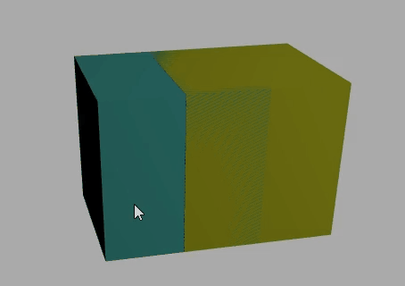
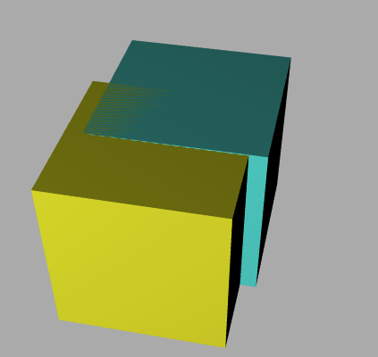
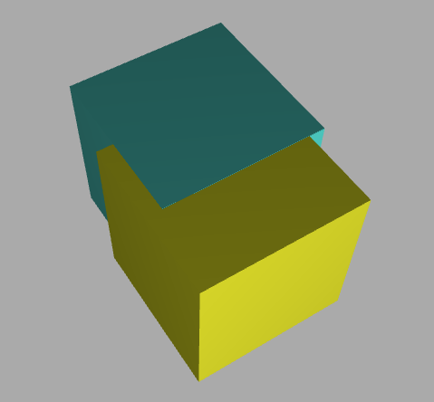
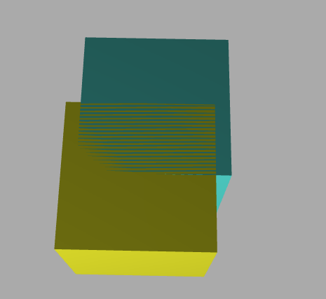

# Threejs——十四、关于深度冲突、重叠、以及加载模型进度条效果实现（附完整代码）
## 深度冲突

两个模型重叠的模型，通过浏览器旋转预览，会发现模型旋转的时候会发生闪烁。
这种情况，主要是两个模型重合，电脑分不清谁在前谁在后，这种情况，可以理解为深度冲突`Z-fighting`。

```js
function addBox() {
  const geometry = new THREE.BoxGeometry(10, 10, 10);
  // 材质
  const material = new THREE.MeshPhysicalMaterial({
    color: 0x51efe4, //0x51efe4设置材质颜色
  });
  // 网络模型
  mesh = new THREE.Mesh(geometry, material);
  mesh.position.set(0, 10, 0);
  const mesh2 = mesh.clone();
  mesh2.geometry = mesh.geometry.clone();
  mesh2.material = mesh.material.clone();
  mesh2.position.x = 5;
  mesh2.material.color.set(0xffff00);
  scene.add(mesh);
  scene.add(mesh2);
}
```

效果：


#### 两个几何体 Mesh 拉开距离

适当偏移，解决深度冲突，偏移尺寸相对模型尺寸比较小，视觉上两个几何体近似还是重合效果。

```js
mesh2.position.z = 1;
```



#### webgl 渲染器设置对数深度缓冲区

这种情况我这里遇到过一次，通过压缩模型后进行放大缩小会发现出现模型闪烁的 bug，所以这里可以用`logarithmicDepthBuffer`解决冲突问题。
**注意：如果两模型面间隙过小，或者重合，，此渲染器对数深度缓冲区也是没有效果的**

```js
// WebGL渲染器设置
const renderer = new THREE.WebGLRenderer({
  // 设置对数深度缓冲区，优化深度冲突问题
  logarithmicDepthBuffer: true,
});
```

区别：

```js
const geometry = new THREE.BoxGeometry(10, 10, 10);
// 材质
const material = new THREE.MeshPhysicalMaterial({
  color: 0x51efe4, //0x51efe4设置材质颜色
});
// 网络模型
mesh = new THREE.Mesh(geometry, material);
mesh.position.set(0, 10, 0);
const mesh2 = mesh.clone();
mesh2.geometry = mesh.geometry.clone();
mesh2.material = mesh.material.clone();
mesh2.position.x = 5;
mesh2.material.color.set(0xffff00);
mesh2.position.z = 1;
mesh.position.y = 10.01;  // 加Y轴
scene.add(mesh);
scene.add(mesh2);
```


不加`logarithmicDepthBuffer`



## 模型加载进度条
这里拿`GLTFLoader`来测试
```js
let loadedData = 0
loader.load(new URL(`../assets/model.glb`, import.meta.url).href,function (gltf) {
      scene.add(gltf.scene);
      render();
    },
    function (xhr) {
      // 后台打印查看模型文件加载进度
    //   console.log("加载完成的百分比" + (xhr.loaded / xhr.total) * 100 + "%");
      loadedData = Math.floor((xhr.loaded / xhr.total) * 100);
    //   console.log(Math.floor((xhr.loaded / xhr.total) * 100));
      if (Math.floor((xhr.loaded / xhr.total) * 100) == 100) {
        setTimeout(() => {
          data.statu = false;
        }, 1000);
      }
    },
    function (err) {
      console.error("加载发生错误");
    }
  );
```
这里可以进行判断，如果`loadedData`等于100，也就是模型加载完毕的时候，那么这段文字就隐藏起来
