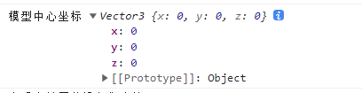

## 正投影相机

正投影相机和透视相机的区别
如果都以高处俯视去看整个场景，正投影相机就类似于 2d 的可视化的效果，透视相机就类似于人眼观察效果

#### 调整 left, right, top, bottom 范围大小

如果你想整体预览全部立方体，就需要调整相机的渲染范围，比如设置上下左右的范围。

使用场景：正投影可以用来预览中国地图，或者 2D 可视化的效果
透视投影相机一般是人在场景用漫游，或者高俯视整个

## 包围盒 Box3

就是将整个模型的所有顶点包裹起来形成一个长方体，此长方体就是 Box3

```js
const geometry = new THREE.BoxGeometry(10, 10, 10);
// 材质
const material = new THREE.MeshPhysicalMaterial({
  color: 0x51efe4, //0x51efe4设置材质颜色
});
// 网络模型
mesh = new THREE.Mesh(geometry, material);
mesh.position.set(0, 0, 0);
const box3 = new THREE.Box3();
box3.expandByObject(mesh); // 计算模型包围盒
console.log("查看包围盒", box3);
scene.add(mesh);
```


#### 包围盒尺寸`.getSize()`

```js
const scale = new THREE.Vector3();
box3.getSize(scale);
console.log("模型包围盒尺寸", scale);
```


#### 包围盒几何中心

```js
const scale = new THREE.Vector3();
box3.getCenter(center);
console.log("模型中心坐标", center);
```



## 相机动画`.position和lookAt()`

改变相机的位置.position，三维场景在 canvas 画布上呈现不同的效果，如果连续改变相机的位置.position，就可以获得一个动画效果。
下面实现一个相机动画

```js
let angle = 0; //用于圆周运动计算的角度值
const R = 10; //相机圆周运动的半径
const render = () => {
  angle += 0.01;
  // 相机y坐标不变，在XOZ平面上做圆周运动
  camera.position.x = R * Math.sin(angle);
  camera.lookAt(0, 0, 0);
  renderer.render(scene, camera);
  requestAnimationFrame(render);
};
render();
```


#### 执行`lookAt()`计算相机视线方向

改变.position 属性后，如果不执行.lookAt()方法，相机的观察方向默认不变。

如果你希望相机圆周运动的同时，改变相机视线方向，保持相机镜头始终指向坐标原点或其它位置，需要每次改变.position 属性后，重新执行一遍.lookAt()方法,意思就是说相机在动画的同时让镜头始终指向原点位置。

## 不同方向的投影视图

```html
<div class="btn">
  <el-button id="x" @click="xyzClick('x')">x</el-button>
  <el-button id="y" @click="xyzClick('y')">y</el-button>
  <el-button id="z" @click="xyzClick('z')">z</el-button>
</div>
```

```css
body {
  position: relative;
}
.btn {
  position: absolute;
  top: 0;
  left: 0;
  z-index: 99;
}
```

```js
const xyzClick = (name) => {
  if (name == "x") {
    camera.position.set(30, 0, 0); //x轴方向观察
    camera.lookAt(0, 0, 0); //重新计算相机视线方向
  } else if (name == "y") {
    camera.position.set(0, 30, 0); //x轴方向观察
    camera.lookAt(0, 0, 0); //重新计算相机视线方向
  } else {
    camera.position.set(0, 0, 30); //x轴方向观察
    camera.lookAt(0, 0, 0); //重新计算相机视线方向
  }
};
```

起始坐标轴位置：

镜头效果如下：


## 旋转渲染结果

这个概念其实就是你拿相机拍摄一个物体，比如从上下左右方向拍，斜着拍，这个时候你的照片呈现的效果就是`旋转效果`。

#### 旋转渲染结果(.up 相机上方向)

`.up`属性默认值是`new THREE.Vector3(0,1,0)`,意思是沿着 y 轴朝上。

```js
console.log(".up默认值", camera.up);
```


更改 up 查看效果

```js
camera.up.set(0, -1, 0);
```


```js
//渲染效果：红色x轴向上
camera.up.set(1, 0, 0);
```


```js
//渲染效果：蓝色z轴向上
camera.up.set(0, 0, 1);
```


#### 执行顺序问题

注意`.up`属性和`.position`属性一样，如果在`.lookAt()`执行之后改变,需要重新执行`.lookAt()`。

```
camera.lookAt(0,0,0);
camera.up.set(0, 0, 1);//改变up
camera.lookAt(0,0,0);//执行lookAt重新计算相机姿态
```

## 管道漫游效果

创建管道

```js
const path = new THREE.CatmullRomCurve3([
  new THREE.Vector3(-50, 20, 90),
  new THREE.Vector3(-10, 40, 40),
  new THREE.Vector3(0, 0, 0),
  new THREE.Vector3(60, -60, 0),
  new THREE.Vector3(90, -40, 60),
  new THREE.Vector3(120, 30, 30),
]);
// 样条曲线path作为TubeGeometry参数生成管道
const geometry = new THREE.TubeGeometry(path, 200, 5, 30);
const texLoader = new THREE.TextureLoader();
//纹理贴图
const texture = texLoader.load(
  new URL(`../assets/wood_table_001_diff_2k.jpg`, import.meta.url).href
);
//UV坐标U方向阵列模式
texture.wrapS = THREE.RepeatWrapping;
//纹理沿着管道方向阵列(UV坐标U方向)
texture.repeat.x = 10;
const material = new THREE.MeshLambertMaterial({
  map: texture,
  side: THREE.DoubleSide, //双面显示看到管道内壁
});
const mesh = new THREE.Mesh(geometry, material);
scene.add(mesh);
```

相机方面选择透视投影相机

#### 获得运动轨迹上的顶点

通过曲线的.getSpacedPoints()方法可以从轨迹线上均匀的获得一系列顶点坐标数据，然后你可以用这些轨迹线上顶点坐标设置相机位置。

```js
const pointsArr = path.getSpacedPoints(500);
```


#### 将相机放在管道内部轨迹线上

相机放在管道内轨迹线上任意一个位置,并控制相机视线和曲线切线重合。
曲线上当前点`pointsArr[i]`和下一个点`pointsArr[i+1]`近似模拟当前点曲线切线，两点间距越小，模拟精度越高。

`.lookAt()`设置相机观察点为当前点`pointsArr[i]`的下一个点`pointsArr[i + 1]`，使相机视线和曲线上当前点切线重合。

```js
// 从曲线上等间距获取一定数量点坐标
const pointsArr = path.getSpacedPoints(500);
const i = 100;
// 相机位置：曲线上当前点pointsArr[i]
camera.position.copy(pointsArr[i]);
// 相机观察目标：当前点的下一个点pointsArr[i + 1]
camera.lookAt(pointsArr[i + 1]);
```

#### 改变视场角度`fov`调节渲染效果

调整相机视椎体不同视场角度`fov`对应的视觉效果

```js
// fov:90度
const camera = new THREE.PerspectiveCamera(90, width / height, 1, 3000);
```


```js
// fov:30度
const camera = new THREE.PerspectiveCamera(30, width / height, 1, 3000);
```


#### 相机控件`.target`和`lookAt()`参数一致

如果相机控件`.target`和`lookAt()`的参数一致，这样就可以实现旋转相机在管道内部

```js
// 相机控件
const control = () => {
  controls = new OrbitControls(camera, renderer.domElement);
  controls.target.copy(pointsArr[i + 1]);
  controls.update();
};
control();
```

效果如下：(此图片是 GIF 压缩后的效果，实际效果比较理想)


#### 给相机添加完整动画

```js
let num = 0;
const render = () => {
  if (num < pointsArr.length - 1) {
    // 相机位置设置在当前点位置
    camera.position.copy(pointsArr[num]);
    // 曲线上当前点pointsArr[num]和下一个点pointsArr[num+1]近似模拟当前点曲线切线
    // 设置相机观察点为当前点的下一个点，相机视线和当前点曲线切线重合
    camera.lookAt(pointsArr[num + 1]);
    num += 1; //调节速度
  } else {
    num = 0;
  }
  renderer.render(scene, camera);
  requestAnimationFrame(render);
};
render();
```


用点模型渲染,会渲染成类似于虫洞的效果

```js
material = new THREE.PointsMaterial({
  map: texture,
  side: THREE.DoubleSide, //双面显示看到管道内壁
});
mesh = new THREE.Points(geometry, material);
```


完整代码：

```html
/* * @Author: SouthernWind * @Date: 2023-06-14 16:38:59 * @Last Modified by:
Mr.Jia * @Last Modified time: 2023-06-27 14:10:21 */

<template>
  <div class="btn">
    <el-button id="x" @click="xyzClick('x')">x</el-button>
    <el-button id="y" @click="xyzClick('y')">y</el-button>
    <el-button id="z" @click="xyzClick('z')">z</el-button>
  </div>
  <div class="container" ref="container"></div>
</template>

<script setup>
  import * as THREE from "three";
  // 轨道
  import { OrbitControls } from "three/examples/jsm/controls/OrbitControls";
  import { GLTFLoader } from "three/addons/loaders/GLTFLoader.js";
  import { GUI } from "three/addons/libs/lil-gui.module.min.js";

  import { ref, reactive, onMounted } from "vue";
  // 三个必备的参数
  let scene,
    camera,
    renderer,
    controls,
    mesh,
    material,
    group,
    texture,
    gui,
    textureCube,
    pointsArr,
    i;

  onMounted(() => {
    // 外层需要获取到dom元素以及浏览器宽高，来对画布设置长宽
    // clientWidth等同于container.value.clientWidth
    let container = document.querySelector(".container");
    const { clientWidth, clientHeight } = container;
    console.log(clientHeight);
    // 首先需要获取场景，这里公共方法放在init函数中
    const init = () => {
      scene = new THREE.Scene();
      // 给相机设置一个背景
      scene.background = new THREE.Color(0xaaaaaa);
      // 透视投影相机PerspectiveCamera
      // 支持的参数：fov, aspect, near, far
      /* camera = new THREE.PerspectiveCamera(
        60,
        clientWidth / clientHeight,
        0.001,
        6000
      ); */
      camera = new THREE.PerspectiveCamera(
        90,
        clientWidth / clientHeight,
        1,
        3000
      );
      camera.position.set(150, 150, 150);
      camera.lookAt(0, 0, 0);
      /*     const width = window.innerWidth; //canvas画布宽度
      const height = window.innerHeight; //canvas画布高度
      const k = width / height; //canvas画布宽高比
      const s = 50; //控制left, right, top, bottom范围大小
      camera = new THREE.OrthographicCamera(-s * k, s * k, s, -s, 1, 8000);
      camera.position.set(15, 15, 15);
      camera.lookAt(0, 0, 0); //指向坐标原点 */
      /*     const width = window.innerWidth; //canvas画布宽度
      const height = window.innerHeight; //canvas画布高度
      const k = width / height; //canvas画布宽高比
      const s = 2000; //控制left, right, top, bottom范围大小
      camera = new THREE.OrthographicCamera(-s * k, s * k, s, -s, 1, 8000); */
      // 相机坐标
      // camera.position.set(30, 30, 30);
      // camera.lookAt(2000, 0, 2000);

      // 渲染器
      renderer = new THREE.WebGLRenderer({
        antialias: true,
        preserveDrawingBuffer: true,
        logarithmicDepthBuffer: true,
      });
      renderer.shadowMap.enabled = true;
      renderer.shadowMap.type = THREE.PCFSoftShadowMap;
      // 渲染多大的地方
      renderer.setClearAlpha(0.0);
      renderer.setSize(clientWidth, clientHeight);
      /* renderer.outputEncoding = THREE.sRGBEncoding; */
      const axesHelper = new THREE.AxesHelper(150);
      scene.add(axesHelper);
      container.appendChild(renderer.domElement);
      addBox();
      console.log("查看当前屏幕设备像素比", window.devicePixelRatio);
    };
    init();
    function addBox() {
      const path = new THREE.CatmullRomCurve3([
        new THREE.Vector3(-50, 20, 90),
        new THREE.Vector3(-10, 40, 40),
        new THREE.Vector3(0, 0, 0),
        new THREE.Vector3(60, -60, 0),
        new THREE.Vector3(90, -40, 60),
        new THREE.Vector3(120, 30, 30),
      ]);
      // 样条曲线path作为TubeGeometry参数生成管道
      const geometry = new THREE.TubeGeometry(path, 200, 5, 30);
      const texLoader = new THREE.TextureLoader();
      //纹理贴图
      const texture = texLoader.load(
        new URL(`../assets/wood_table_001_diff_2k.jpg`, import.meta.url).href
      );
      //UV坐标U方向阵列模式
      texture.wrapS = THREE.RepeatWrapping;
      //纹理沿着管道方向阵列(UV坐标U方向)
      texture.repeat.x = 10;
      material = new THREE.PointsMaterial({
        map: texture,
        side: THREE.DoubleSide, //双面显示看到管道内壁
      });
      mesh = new THREE.Points(geometry, material);
      scene.add(mesh);
      pointsArr = path.getSpacedPoints(500);
      console.log(pointsArr);
       i = 100;
      // 相机位置：曲线上当前点pointsArr[i]
      camera.position.copy(pointsArr[i]);
      // 相机观察目标：当前点的下一个点pointsArr[i + 1]
      camera.lookAt(pointsArr[i + 1]);

      // 创建线模型对象
      // const geometry = new THREE.BoxGeometry(10, 10, 10);
      // // 材质
      // const material = new THREE.MeshPhysicalMaterial({
      //   color: 0x51efe4, //0x51efe4设置材质颜色
      // });
      // // 网络模型
      // mesh = new THREE.Mesh(geometry, material);
      // mesh.position.set(0, 0, 0);
      // const box3 = new THREE.Box3();
      // box3.expandByObject(mesh); // 计算模型包围盒
      // console.log("查看包围盒", box3);
      // const scale = new THREE.Vector3();
      // box3.getSize(scale);
      // console.log("模型包围盒尺寸", scale);
      // box3.getCenter(scale);
      // console.log("模型中心坐标", scale);
      // scene.add(mesh);
      // console.log('.up默认值',camera.up);
      // // camera.up.set(0,-1,0)
      // //渲染效果：红色x轴向上
      // // camera.up.set(1, 0, 0);
      // //渲染效果：蓝色z轴向上
      // camera.up.set(0, 0, 1);
      // /*     new GLTFLoader().load(
      //   new URL(`../assets/1.glb`, import.meta.url).href,
      //   (gltf) => {
      //     let gltfs = gltf.scene;
      //     gltfs.scale.set(5, 5, 5);

      //     scene.add(gltfs);
      //   }
      // ); */
    }

    // 相机控件
    const control = () => {
      controls = new OrbitControls(camera, renderer.domElement);
      controls.target.copy(pointsArr[i + 1]);
      controls.update();
      controls.addEventListener("change", function () {});
    };
    control();

    // 光源
    const linght = () => {
      /*     const pointLight = new THREE.PointLight(0xffffff, 1.0);
      // pointLight.position.set(400, 0, 0);//点光源放在x轴上
      pointLight.position.set(10, 10, 10); //设置光源的位置
      // 光源和网格模型Mesh对应一样是三维场景的一部分，自然需要添加到三维场景中才能起作用。
      scene.add(pointLight); // 添加光源到场景中 */

      const pointLight = new THREE.AmbientLight(0xffffff, 1.0);
      pointLight.position.set(10, 10, 10);
      scene.add(pointLight);
      /*     const pointLightHelper = new THREE.PointLightHelper(pointLight, 1);
      scene.add(pointLightHelper); */
    };
    linght();
    // 渲染循环
    /*   let angle = 0; //用于圆周运动计算的角度值
    const R = 10; //相机圆周运动的半径 */
    let num = 0;
    const render = () => {
      /*     angle += 0.01;
      // 相机y坐标不变，在XOZ平面上做圆周运动
      camera.position.x = R * Math.sin(angle);
      camera.lookAt(0, 0, 0); */
      if (num < pointsArr.length - 1) {
          // 相机位置设置在当前点位置
          camera.position.copy(pointsArr[num]);
          // 曲线上当前点pointsArr[num]和下一个点pointsArr[num+1]近似模拟当前点曲线切线
          // 设置相机观察点为当前点的下一个点，相机视线和当前点曲线切线重合
          camera.lookAt(pointsArr[num + 1]);
          num += 1; //调节速度
      } else {
          num = 0
      }
      renderer.render(scene, camera);
      requestAnimationFrame(render);
    };
    render();
    window.addEventListener("resize", () => {
      // 更新摄像头
      camera.aspect = window.innerWidth / window.innerHeight;
      // 相机参数更新
      camera.updateProjectionMatrix();
      renderer.setSize(window.innerWidth, window.innerHeight);
    });
  });
  const xyzClick = (name) => {
    if (name == "x") {
      camera.position.set(30, 0, 0); //x轴方向观察
      camera.lookAt(0, 0, 0); //重新计算相机视线方向
    } else if (name == "y") {
      camera.position.set(0, 30, 0); //x轴方向观察
      camera.lookAt(0, 0, 0); //重新计算相机视线方向
    } else {
      camera.position.set(0, 0, 30); //x轴方向观察
      camera.lookAt(0, 0, 0); //重新计算相机视线方向
    }
  };
</script>

<style>
  .container {
    width: 100%;
    height: 100vh;
    position: relative;
    z-index: 1;
    /* background: #ff5810; */
  }
  .btn {
    position: absolute;
    top: 0;
    left: 0;
    z-index: 99;
  }
</style>
```

## `OrbitControls`旋转缩放限制

#### 禁止右键平移 `.enablePan`属性

例：

```js
controls.enablePan = false; //禁止右键拖拽
```

#### 禁止缩放或旋转

通过`.enableZoom`属性可以控制是否允许鼠标中键缩放场景,`.enableZoom`属性默认为 true

```js
controls.enableZoom = false; //禁止缩放
```

禁止旋转

```js
controls.enableRotate = false; //禁止旋转
```

#### OrbitControls`.target`属性

**特此注意：相机控件 OrbitControls`.target`属性对应的就是相机的`.lookAt()`观察目标。**

```js
// controls.target默认值是坐标原点
controls.target.set(x, y, z);
//update()函数内会执行camera.lookAt(x, y, z)
controls.update();
```

#### 透视投影相机缩放范围

`.minDistance`和`.maxDistance`用来控制当前为透视投影相机时鼠标中键缩放的范围

```js
// 相机位置与观察目标点最小值
controls.minDistance = 10;
// 相机位置与观察目标点最大值
controls.maxDistance = 30;
```

#### 正投影相机缩放范围

`.minZoom`和`.maxZoom`用来控制当前为正投影相机时鼠标中键缩放的范围

#### 相机位置与目标观察点距离`.getDistance()`

controls.getDistance()可以计算出来相机位置.position 和相机目标观察点 controls.target 的距离。

```js
//相机位置与目标观察点距离
const dis = controls.getDistance();
console.log("dis", dis);
```

#### 不确定缩放具体范围，可以通过`.getDistance()`辅助解决

将他绑定在 change 事件中

```js
controls.addEventListener("change", function () {
  //相机位置与目标观察点距离
  const dis = controls.getDistance();
  console.log("dis", dis);
});
```

这时当缩放到差不多的时候取最小和最大缩放值即可


#### 设置旋转范围`.minPolarAngle`和`.maxPolarAngle`
**展示一个模型，如果不想旋转到底部，可以通过设置相机旋转属性范围来实现**
通过`.minPolarAngle`、`.maxPolarAngle`、`.minAzimuthAngle`和`.maxAzimuthAngle`属性控制上下左右的旋转范围，默认从0到180度，默认情况下0度，XOZ平面平行canvas画布，y轴垂直指向屏幕外，90度时候，渲染结果y轴竖直向上，180度，XOZ平面平行canvas画布，y轴垂直指向屏幕内。

默认旋转范围：
```js
    controls.minPolarAngle = 0; //默认值0
    controls.maxPolarAngle = Math.PI/2; //默认值Math.PI
```
将`.maxPolarAngle`属性设置为90度，那么就看不到底部了
```js
controls.maxPolarAngle = Math.PI/2;
```

设置左右旋转范围
```js
// 左右旋转范围
controls.minAzimuthAngle = -Math.PI/2;
controls.maxAzimuthAngle = Math.PI/2;
```


## 相机控件`MapControls`
引入方式
```js
// 引入相机控件`MapControls`
import { MapControls } from 'three/addons/controls/OrbitControls.js';
```
替换相机控件
```js
const controls = new MapControls(camera, renderer.domElement);
```
效果：


MapControls本质上就是改变相机的参数，比如相机的位置属性、相机目标观察点。

#### 缩放、旋转或平移禁止
跟OrbitControls的效果是一样的，只是鼠标操作有所差异
```js
controls.enablePan = false; //禁止平移
controls.enableZoom = false;//禁止缩放
controls.enableRotate = false; //禁止旋转
```

#### 透视投影相机缩放范围
```js
//相机位置与观察目标点最小值
controls.minDistance = 2;
//相机位置与观察目标点最大值
controls.maxDistance = 5;
```

#### 设置旋转范围
同理
```js
// 上下旋转范围
controls.minPolarAngle = 0;
controls.maxPolarAngle = Math.PI/2;
// 左右旋转范围
controls.minAzimuthAngle = -Math.PI/2;
controls.maxAzimuthAngle = Math.PI/2;
```