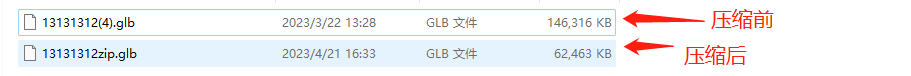
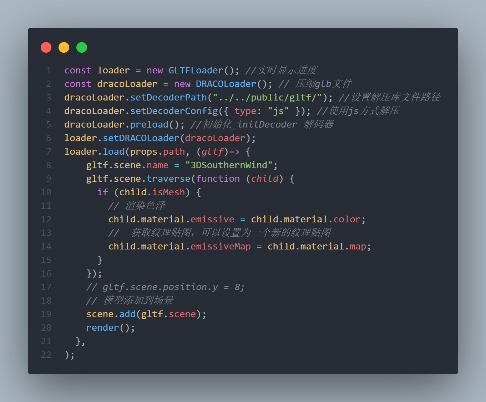
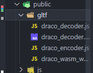

## Three——glb模型压缩
web开发基于Vue3对three.js加载3d模型过程中，往往会出现模型太大导致前端加载时间过长，降低用户使用的体验，我们这里选取gltf-pipeline的DRACOLoader方式来解压模型。
1. 首先需要全局安装
```js
// npm安装
npm install -g gltf-pipeline

// yarn安装
yarn global add gltf-pipeline
```
常用的压缩命令
```js  
gltf-pipeline -i 13131312(4).glb -o 13131312zip.glb -d
```

我们可以看到，使用Draco压缩网络模型会比之前小了将近一半，这个是会根据纹理，面等一系列材质有关

在Vue3中使用
```
// 导入glb模型
import { GLTFLoader } from "three/addons/loaders/GLTFLoader.js";
// 压缩模型包
import { DRACOLoader } from "three/examples/jsm/loaders/DRACOLoader";
```
```js
  const loader = new GLTFLoader(); //实时显示进度
  const dracoLoader = new DRACOLoader(); // 压缩glb文件
  dracoLoader.setDecoderPath("../../public/gltf/"); //设置解压库文件路径
  dracoLoader.setDecoderConfig({ type: "js" }); //使用js方式解压
  dracoLoader.preload(); //初始化_initDecoder 解码器
  loader.setDRACOLoader(dracoLoader);
  loader.load(props.path, (gltf)=> {
      gltf.scene.name = "3DSouthernWind";
      gltf.scene.traverse(function (child) {
        if (child.isMesh) {
          // 渲染色泽
          child.material.emissive = child.material.color;
          //  获取纹理贴图，可以设置为一个新的纹理贴图
          child.material.emissiveMap = child.material.map;
        }
      });
      // gltf.scene.position.y = 8;
      // 模型添加到场景
      scene.add(gltf.scene);
      render();
    },
  );
```

`dracoLoader.setDecoderPath`是用来设置解压库的文件路径，这个需要根据实际位置去获取路径中的js


`props.path`这个位置替换成压缩后的图片路径即可
我这里是放在src的assets文件夹下
`Vue3`引入本地模型路径
```js
const path = new URL(`../assets/SouthernWind.glb`, import.meta.url).href;
```
`Vue2`引入本地模型路径
```js
const path = require(../assets/SouthernWind.glb)
```